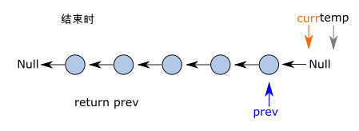

# Approach 1: iterative solution
<!-- Describe your approach to solving the problem. -->
How to reverse a linked list, 比较经典的一题, 同时考到了`linked list`和`two pointer technique`. 

这一题属于`two pointer technique`中的same-direction题型，同时俩pointer traverse at same speed but offset by one.


## 错误思路
我第一次做这一题的时候，有几个思路:
- 将linked list一个一个放到array中; 然后reverse;然后重新插入 (当场veto, 肯定太慢过不了super long test cases)
- two pointer offset by one 


## Algorithm
<!-- Describe your first thoughts on how to solve this problem. -->

Set up two pointer `curr` and `prev`, which set to be the first node and null, respectively.


> 在这里并不是设置了dummy header node, 只是设置了`null` which will be the tail node for the reversed linked list.

由于pointer `curr`和`prev`做same direction scan, 有以下几个问题:
- 你肯定需要`curr.next = prev`将current node指向previous node, 但你会丢失next node在哪, 所以你需啊建立一个指针`temp`来指向next code (idea is exactly like int value swapping with `temp`)

第一个循环如下图:
- `temp = curr.next`: create a pointer points to next node
- `curr.next = prev`: points the current node to the previous node. 
- `prev = current`: previous pointer advances by one.
- `current = temp`: current pointer advances by one


第二个循环也类似


由此直到`curr` pointer hits `null`,最后的diagram如下图, 这时候`curr` points to Null while `prev` is the new "head" for this reversed list. `return prev` 




## Complexity
- Time complexity: $O(n)$ one pass solution.
<!-- Add your time complexity here, e.g. $$O(n)$$ -->

- Space complexity: $O(1)$
<!-- Add your space complexity here, e.g. $$O(n)$$ -->

## Code
```python
# Definition for singly-linked list.
class ListNode:
    def __init__(self, val=0, next=None):
        self.val = val
        self.next = next
class Solution:
    def reverseList(self, head: Optional[ListNode]) -> Optional[ListNode]:
        
        # Iteratative sotluon
        # set up two pointer
        prev = None
        curr = head

        while curr:
            # assuming curr at node[i], prev at node[i-1], index convention是根据old linked list

            # construct a temo points to node[i+1]
            temp = curr.next
            # points node[i] to node[i-1]
            curr.next = prev
            # update prev from node[i-1] to node[i]
            prev = curr
            # update curr pointer to node[i+1] (for the old linked list)
            curr = temp
        
        # iteration结束时, curr在null, prev是new head of the linked list
        return prev

```


> Follow up: Reverse a linked list could also be solved both iteratively and recursively. Implement the recursive solution.


# Approach: recursive solution

