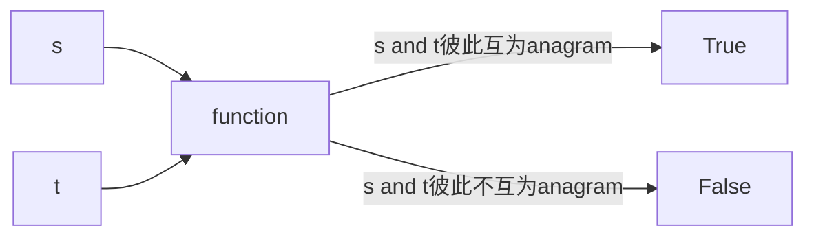

# Intuition
<!-- Describe your first thoughts on how to solve this problem. -->
判断两个string是否互为anagram的依据为, 其中每个`char`出现的
次数都相同即可, 那只需要构建一个hash来储存key-value pair:
- `key`: character in the string. 例子 s= 'abcd'则这个hash一共有四个key
- `value`: the occurance of the key in the string. 例子 s= 'abcc'则 
  
```python
hash = {
    'a' :1,
    'b' :1,
    'c': 2 #代表出现了两次
}
```


> Harry potter: `I am Lord Voldemort` and `Tom Marvolo Riddle` 彼此就是anagram.


# Approach
<!-- Describe your approach to solving the problem. -->



具体步骤如下：
- 构建一个empty hash
- traverse through string `s`, 将每个character出现的次数累加到value上
- traverse through string `t`, 每个string t 中char出现一次，hash 对应的value 减去1


# Complexity
假设s和t的大小系数用一个`n`

- Time complexity: $O(n) + O(n) + O(n) \approx O(n)$
<!-- Add your time complexity here, e.g. $$O(n)$$ -->

- Space complexity: $O(n)$ 需要构建一个hash;  
<!-- Add your space complexity here, e.g. $$O(n)$$ -->


# Code
```python
class Solution:
    def isAnagram(self, s: str, t: str) -> bool:
        
        # hash储存key-value pair 
        # key: every distinct char
        # value: 该char在string中出现的总次数
        hashtable = {}

        # iterate through string s 
        for i in range(len(s)):
            # 判断该char是否在里面, 如果在，累加一次
            if s[i] in hashtable.keys():
                hashtable[s[i]] += 1
            else:
                # 该char第一次出现
                hashtable[s[i]] = 1

        for j in range(len(t)):
            if t[j] in hashtable.keys():
                hashtable[t[j]] -= 1
            else:
                # 在string t中发现了new char, 不是anagram
                return False

        # 
        for item in hashtable:
            # 如果有哪一个value, 不是0, 则说明多出现了或者少出现了一次
            if hashtable[item] != 0:
                return False

        return True
```