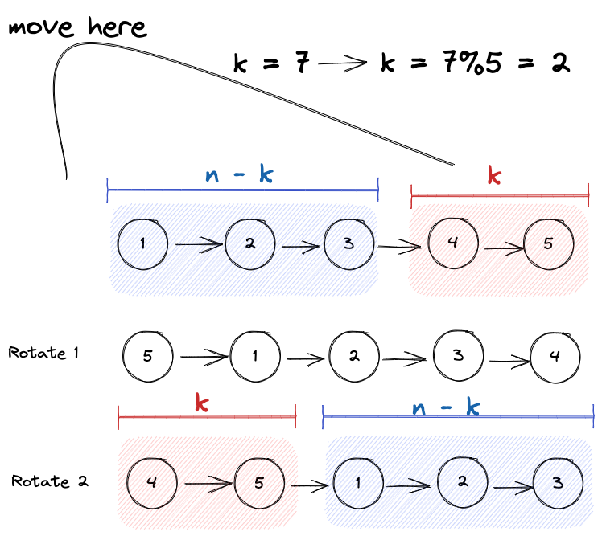

# Problem

Given the `head` of a linked list, rotate the list to the right by `k` places.

*Example1*


```
Input: head = [1,2,3,4,5], k = 2
Output: [4,5,1,2,3]
```

*Example2*


```
Input: head = [0,1,2], k = 4
Output: [2,0,1]
```
Constraints:

- The number of nodes in the list is in the range `[0, 500]`.
- `-100 <= Node.val <= 100`
- 0 $\leq$ k $\leq$ 2 * $10^9$

# Solution

你的第一直觉很可能是cut off tail node and 续在前面, 一共操作k次，但根据problem constrains, k的upper limit比linked list中nodes的数量多这么多，你就知道这并不可能. 

如果链表长度`n = 3`，给定的输入`k`, 每五次就会回到starting position as illustrated in example 2 above. 这样的话, 我们实际需要挪动的次数$k_{real}$为
$$
k_{real} = k\%n
$$
Instead of doing $k_{real}$ times, we can just do 1 single operation, we just need to find the pattern. 我们知道k and n, 那只需要将整个linked list分为两块即可，



具体操作的话，需要知道three pointers 以及链表长度

我们通过first time traversal来获得:
- 链表长度 `n`
- tail pointer that points to `tail node`

2nd time traversal for a fixed # of times `n-k` to find
- tail of the blue chunk
- head of the red chunk


# Edge cases
这一题edge cases比较多的
- head is None, 不管k多大，都是None, 所以`return head`
- k = 0, no rotation, 所以`return head` 
- n%k == 0, 旋转回自身，等于白旋转, `return head`

# Code
```python
# Definition for singly-linked list.
# class ListNode:
#     def __init__(self, val=0, next=None):
#         self.val = val
#         self.next = next
class Solution:
    def rotateRight(self, head: Optional[ListNode], k: int) -> Optional[ListNode]:
        # range of k is fairly large, need to calculate the lenght of linked list and modulus it.
        if k == 0 or head is None: return head
        

        # n the length of linked list
        n = 0
        dummy = ListNode(None,head)
        tail, curr = dummy, head
        while curr:
            n += 1
            curr = curr.next
            tail = tail.next

        if k%n == 0: return head
        
        # update k
        k = k%n

        prev,curr = dummy, head
        
        for i in range(n - k):
            prev = prev.next
            curr = curr.next
        
        prev.next = None
        dummy.next = curr
        tail.next = head
    
        return dummy.next
```