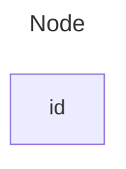

# Readme

刷题日记，现在cover的内容如下

- hash
- binary search

# Hash

[1-two-sum](./1-two-sum/)

## in-place algorithm
generally speaking, in-place algorithm performs better in terms of space and time complexitity, but it suffers in concurrent setting. When `input` has been modified during function written with in-place algo, other functions in other thread can't access it and have to wait for the function finishes.

## recursive vs iterative 
iterative approaches, generally, outperforms recursive approach in terms of space complexity. The reason is that recursive approach have to put all function in stack waiting to be executed in order.  

`find . -print | grep -i -e '\\.py$' > python.txt`

