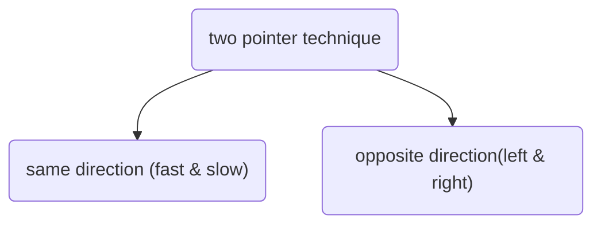

# Two Pointer Technique

Two pointer technique，在解决linked list和arra问题中，是一种很常见的technique. 在Array中，pointer指的就是index. 

有两种思路:
- `same direction problem` with fast and slow pointer moving at different pace (one moves faster than another)
- `opposite direction problem` with one pointer at left end while another at right end of the data structure

# Reference

[medium notes two pointer approach](https://towardsdatascience.com/two-pointer-approach-python-code-f3986b602640#:~:text=Two%20pointer%20algorithm%20is%20one,pairs%20in%20a%20sorted%20array.)