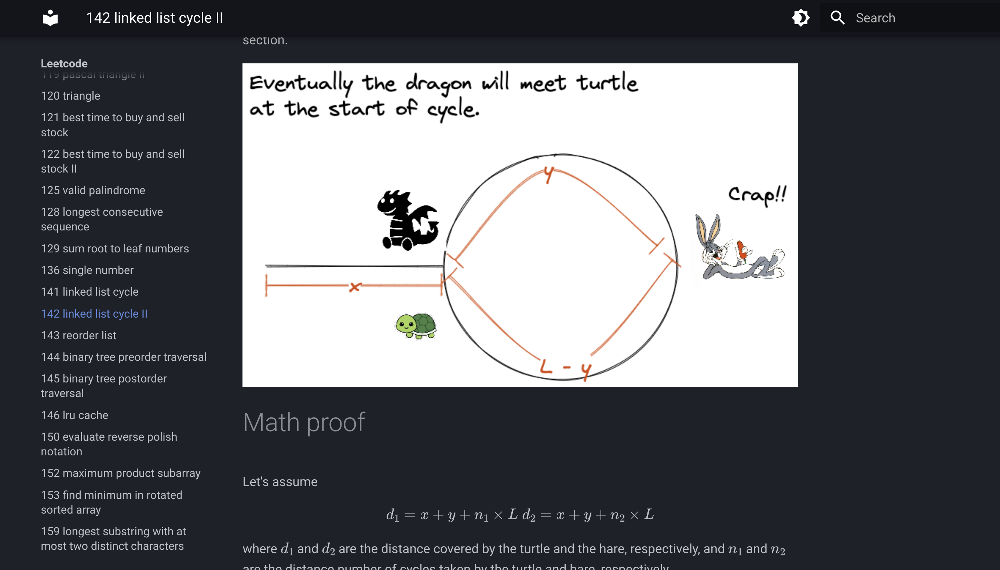

# Leetcode 

A static web-app for 

- storing Leetcode solution
- DSA notes




> [!TIP]
> Deployed to [here](https://a4lamber.github.io/Leetcode/), currently in a hybrid of Chinese of English.


## How to run locally

to build

```bash
mkdocs build --config-file ./leetcode_with_adam/mkdocs.yml --verbose --strict -d public 

mkdocs serve --config-file ./leetcode_with_adam/mkdocs.yml -a 0.0.0.0:8001
```

## Run with docker

```bash
docker image build -t leetcode .

# burner container
docker container run -p 8000:8000 --rm leetcode 
```

