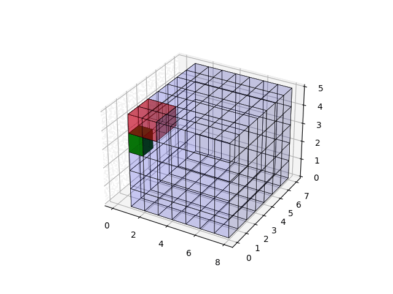

# Leetcode Blog

A static web-app for 

- storing Leetcode solution
- DSA notes

Animated visualization for how information propagate in the solution domain in DP problem, 



Demo here:


> [!TIP]
> Deployed to [here](https://a4lamber.github.io/Leetcode/), currently in a hybrid of Chinese of English.

## How to run

### Run locally

to build

```bash
mkdocs build --config-file ./leetcode_with_adam/mkdocs.yml --verbose --strict -d public 

mkdocs serve --config-file ./leetcode_with_adam/mkdocs.yml -a 0.0.0.0:8001
```

### Run with docker

```bash
docker image build -t leetcode .

# burner container
docker container run -p 8000:8000 --rm leetcode 
```

## Main Tabs

- `Home`: landing page
- `Leetcode`: Leetcode solution
- `Algorithm`: algorithm
- `Data Structure`: data structure by topic
- `String`: dedicated page for string matching like KMP and Rabin-Karp
- `Techniques`: techniques that can't be categorized into the algorithm but useful in solving problems
- `Contest`: contest solution and self-reflection.