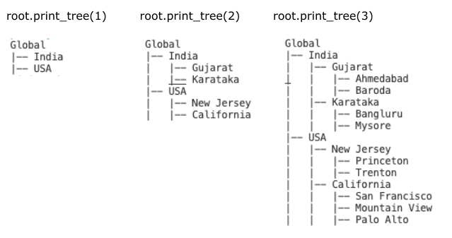

# Readme
---

I implemented the genereal tree using the codebasics tutorial. The code is in the hyperlink here.

## Problem 1 (from codebasics)
Below is the management hierarchy of a company:
```
Nilupul (CEO)
    |__Chinmay (CTO)
        |__Vishwa (Infrastructure Head)
            |__Dhaval (Cloud Manager)
            |__Abhijit (App Manager)
        |__Aamir (Application Head)
    |__Gels (HR Head)
        |__Peter (Recruitment Manager)
        |__Waqas (Policy Manager)
```
Extend [tree](./generalTree.py) class built in our main tutorial so that it takes name and designation in data part of TreeNode class. Now extend print_tree function such that it can print either name tree, designation tree or name and designation tree. As shown below,

```python
Nilupul
|-- Chinmay
|   |-- Vishwa
|   |   |-- Dhaval
|   |   |-- Abhijit
|   |-- Aamir
|-- Gels
|   |-- Peter
|   |-- Waqas

CEO
|-- CTO
|   |-- Infrastructure Head
|   |   |-- Cloud Manager
|   |   |-- App Manager
|   |-- Application Head
|-- HR Head
|   |-- Recruitment Manager
|   |-- Policy Manager

Nilupul (CEO)
|-- Chinmay (CTO)
|   |-- Vishwa (Infrastructure Head)
|   |   |-- Dhaval (Cloud Manager)
|   |   |-- Abhijit (App Manager)
|   |-- Aamir (Application Head)
|-- Gels (HR Head)
|   |-- Peter (Recruitment Manager)
|   |-- Waqas (Policy Manager)
```

Here is how your main function should will look like,
```python
if __name__ == '__main__':
    root_node = build_management_tree()
    root_node.print_tree("name") # prints only name hierarchy
    root_node.print_tree("designation") # prints only designation hierarchy
    root_node.print_tree("both") # prints both (name and designation) hierarchy
```

[solution](./solution/exercise1_solution.py)

# Problem 2 Build below location tree using tree node class.

now modifiy the `print_tree()` method to take tree level as input and that should print tree upto that level as show below.



[solution](./solution/exercise2_solutoin.py)

> Follow-up: what if we are using node at height 1 to print? How should we handle it?

