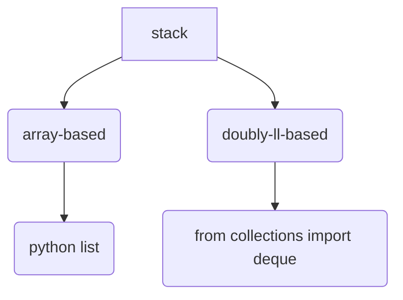

# Stack
---
In this section, it will cover the data structure `stack`.

- [Stack](#stack)
  - [Understanding](#understanding)
  - [Implementation](#implementation)
- [Reference](#reference)

## Understanding
use tray in cafeteria to understand this.

## Implementation
In python at least, it hast two main ways of implementing a stack. One is array-based implmentation and another is doubly-linked-list implemented.

# Reference
[real python stack](https://realpython.com/how-to-implement-python-stack/)