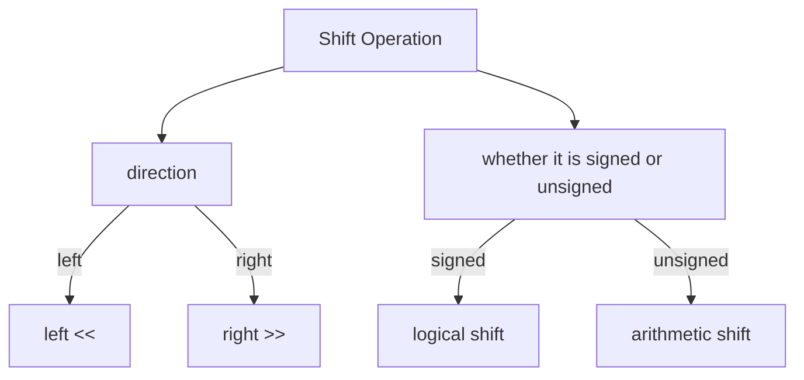
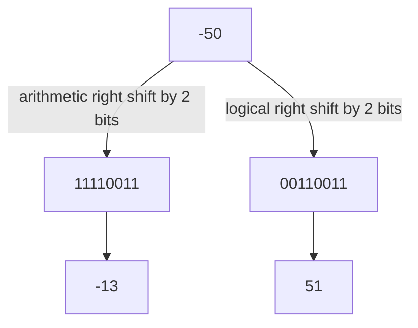

# Bit Manipulation

In this section, we will try to understand the following:

- base
- representing integers (optional)
- bit operators


## 1. Base

Base也就是我们熟悉的2进制，8进制，16进制等等。这些都是base。是一种表达数字的方式方法，我们人类最熟悉的是十进制, 

先来看两个例子123.45 in base 10,

$$
123.45 = 1*10^2 + 2*10^1 + 3*10^0 + 4*10^{-1} + 5*10^{-2}
$$

再来看`base-8`转换到base 10， 

$$
720.5_{\left(8\right)} = 7*8^2 + 2*8^1 + 0*8^0 + 5*8^{-1} = 464.625_{\left(10\right)}
$$

看完这两个例子后，我们来对应weight在base中的意义，123.45的weights为

- 小数点后有两位, $10^{-1}$ and $10^{-2}$.
- 小数点前有三位, $10^0$, $10^1$, and $10^2$.

由这些weights就能组成数字.

### 1.1 Conversion Between Bases

人类十进制，计算机二进制，八进制(octal)，十六进制(hexadecimal)。这些都是常用的base. 比如十进制转化到二进制, 50 in base-10 to base-2,

```
50 / 2 = 25; 50 % 2 = 0
25 / 2 = 12; 25 % 2 = 1
12 / 2 = 6; 12 % 2 = 0
6 / 2 = 3; 6 % 2 = 0
3 / 2 = 1; 3 % 2 = 1
1 / 2 = 0; 1 % 2 = 1
```

然后traverse the remainders from bottom to top, we get $50_{(10)} = 110010_{(2)}$. 对于小数，我们可以用类似的方法，不过是乘以2. 比如0.6875 to base-2,

```
0.6875 × 2 = 1.375 with integer 1
0.375 × 2 = 0.75 with integer 0
0.75 × 2 = 1.5 with integer 1
0.5 × 2 = 1 with integer 1
```

Traverse the integer part from top to bottom, we get $0.6875_{(10)} = 0.1011_{(2)}$.


!!! warning warning
    A finite fraction in one base may become infinite in another case. 比如1/3 in base-10 is 0.3333...，但是在base-3中是0.1.


## 2 Representing Integers

计算机用binary, 每一个digit(位)，用计算机术语叫做bit,  can only be `0` or `1`. 也就是说，`m` digits的二进制，能表示的数字是$2^m$ in base-10. 或者说, $2^m$表示的是可能性. 

!!! tip tip
    对于可能性的理解，你可以想象成你抛硬币，硬币正反两面对应0和1. 你抛`m`次硬币，你有$2^m$种可能性. 同理for m digits in a row like `_,_,_...,_,_`, you have $2^m$ possibilities.


bit单位太小了，所以有了1 byte = 8 bits. bytes能表达的, 

- 1-byte number, i.e. 8 bits with $2^8$ possibilities, 0 to 255.
- 2-byte number, i.e. 16 bits with $2^{16}$ possibilities, 0 to 65535.
- 4-byte number, i.e. 32 bits with $2^{32}$ possibilities, 0 to 4294967295.
- 8-byte number, i.e. 64 bits with $2^{64}$ possibilities, 0 to 18446744073709551615.

## 3. Signed and Unsigned Integers

我们之前的讨论，包括了正整数和小数，但没讨论过负数。计算机需要表达正数和负数，因此有一个概念叫`sign bit`, 假设我们有一个1 byte, 如下图所示


其中1 byte中的第一位是sign bit, 0表示正数，1表示负数。剩下的7位是magnitude bits, 用来表示数字的大小。也就是说，同样的一个数据类型，根据定义不同，能表示的数字范围也不同。比如, 

- 1 byte signed integer. 因为$2^7$ = 128 for magnitude bits, 然后sign bit表达0或者1， 所以推理出-128 to 127
- 1 byte unsigned integer. $2^8$ = 256, 所以0 to 255.

由以上，我们可以总结出,

- `n` bits signed integer, $-2^{n-1}$ to $2^{n-1}-1$. For unsigned integer, 0 to $2^n-1$.

## 3. The Original Code, Inverse Code and Complement Code


### 3.1 Machine Number and Truth Value

先得知道俩概念， `machine number` and `truth value`.

- `machine number`: The binary representation of a number in a computer is called its machine number. It's a signed number.
- `truth value`: 用来区分和纯2进制的区别。

比如，the truth value of `00000010` is +2 and truth value of `10000010` is -2. 但real value of 10000010 is 130. 


### 3.2 Original Code

`The original code` is the sign bit of the machine number plus the absolute value of the truth value of the machine number.

The original code for +10 is 00001010 and for -10 is 10001010. 

### 3.3 Inverse Code

`The inverse code` 是derived from original code. 定义为:

- 对于非负数, inverse code is the same as the original code.
- 对于负数, inverse code flip every bit of the original code except the sign bit. `flip`的定义为0变成1, 1变成0.

|-|original code|inverse code|
|---|---|---|
|+10|00001010|00001010|
|-10|10001010|11110101|

### 3.4 Complement Code

`The complement code` 是derived from the inverse code. 定义为:

- 对于非负数, complement code is the same as the inverse code.
- 对于负数, complement code is the inverse code plus $1_{\left(2\right)}$.

|-|original code|inverse code|complement code|
|---|---|---|-|
|+10|00001010|00001010|00001010|
|-10|10001010|11110101|11110110|


### 3.5 有啥用?

主要是为了方便人脑计算. 


## 4 Bit Operations

一共有6种bit operations, AND, OR, XOR, negation, left shift and right shift 如下表

|Operation|Symbol|Description|
|---|---|---|
|AND|`&`|两个bit都是1，结果是1|
|OR|$\mid$|两个bit有一个是1，结果是1|
|XOR|`^`|两个bit不一样，结果是1|
|NOT|`~`|flip bit|
|Left Shift|`<<`|左移|
|Right Shift|`>>`|右移|


### 4.1 AND, OR, XOR and Negation

The symbol for `AND` is `&`. 两个bit都是1，结果是1. 

The symbol for `OR` is $\mid$. 两个bit只要有一个是1，结果是1.

The symbol for `XOR` is `^` (python) but in math $\oplus$. 两个bit不一样，结果是1, 比如

- 0 $\oplus$ 0 = 0
- 0 $\oplus$ 1 = 1
- 1 $\oplus$ 0 = 1
- 1 $\oplus$ 1 = 0

其实也可以用来表达venn's diagram. 代表着symmetric set difference, 也就是说，两个集合的差集，不包括交集. 比如$A \oplus B = (A-B) \cup (B-A)$. 其实也就是exclusive or了. 


The symbol for `NOT` is `~`. flip bit.

- `~0` = 1
- `~1` = 0

!!! tip tip
    For Negation, 你先求出原数的complement code, 然后加1.比如你有一个数，-1， 你先求1 in binary 0001, 然后flip bit, 1110, 然后加1, 1111. 或者用我们之前学的, 先学`original code` of -1, 10000001, 然后`inverse code`, 01111110, 然后`complement code`, 01111111.

你可以做点简单的exercise来理解这些操作. 


### 4.2 Left and Right Shift



For left shift `<<`, all binary bits are shifted to the left by a certain number of positions. The high bits are discarded and the low bits are filled with 0.

For right shift `>>`, all binary bits are shifted to the right by a certain number of positions. The low bits are discarded and, 

- for arithmetic shift, the high bits are filled with the highest bit, 最左边的bit, 也就是sign bit. 就是保留符号的shift.
- for logical shift, the high bits are filled with 0. 也就是不保留符号的shift.

!!! warning warning
    对于正整数，logical shift和arithmetic shift是一样的。但是对于负数，logical shift和arithmetic shift是不一样的。

-50 in binary is 11001110. 



### 4.3 shift operation与乘除法的关系

这也是为什么我们要学这玩意. 


#### 4.3.1 left shift and multiplication

left shift `<<` 对应着multiplication. 比如shift 29 by 2 bits is 116, which is same as 29 * 4. 实际上很好理解，因为we discard high bits and fill low bits with 0, 也就是说我们代表的可能性整体增加了$2^2$. 29 in binary is 11101, shift之后是1110100, which is 116. 我们解刨一下29 = 11101, 代入weights,

$$
29_{(10)} = 2^4 + 2^3 + 2^0 = 11101_{(2)}
$$

We shift it to the left by 2, 

$$
\begin{align}
1110100_{(2)} &= 2^6 + 2^5 + 2^2 \\
              &= 2^2 (2^4 + 2^3 + 2^0) \\
              &= 4 \times 29_{(10)} \\
\end{align}
$$

这是以2为multiplier的情况，如果是以其他数为multiplier，可以用$\sum 2^n$的线性组合表示, 比如你想要一个数 a x 6, `(a << 2) + (a << 1)`. 也就是$2^2 + 2^1 = 6$


!!! warning overflow
    但是要注意，如果乘法结果超过了数据类型能表示的范围，就会overflow. 比如32位的int, 2^31-1 = 2147483647, 2^31 = 2147483648, 超过了int能表示的范围.

#### 4.3.2 right shift and division

arithmetic right shift `>>` 对应着division. 50经过2位arithmetic right shift, 得到12， 也就是$\frac{50}{2^2}$, 这个只对正整数hold.

### 4.4 Properties of Bit Operations

Assuming signed integers,


|-|formulation|description|example|
|---|---|---|-|
|idempotent law|$a \& a = a, a \mid a = a$|我operate我自己，还是我自己.|-|
|commutative law|$a \& b = b \& a$, $a \mid b = b \mid a$, $a \oplus b = b \oplus a$|交换律|-|
|associative law|$(a \& b) \& c = a \& (b \& c)$, $(a \mid b) \mid c = a \mid (b \mid c)$, $(a \oplus b) \oplus c = a \oplus (b \oplus c)$|结合律|-|
|distributive law|$a \& (b \mid c) = (a \& b) \mid (a \& c)$, $a \mid (b \& c) = (a \mid b) \& (a \mid c)$,$a \oplus (b \& c) = (a \oplus b) \& (a \oplus c)$, |分配律|-|
|De Morgan's law|$\sim (a \& b) = \sim a \mid \sim b$, $\sim (a \mid b) = \sim a \& \sim b$|德摩根定律|-|

上述这些法则之外，加减乘除法也有对应的法则，比如

- AND Operation: 
    - $a \& 0 = 0$, 
    - $a \& (-1) = a$, 
    - $a \& (\sim a) = 0$
- OR Operation: 
    - $a \mid 0 = a$, 
    - $a \mid (\sim a) = -1$
- XOR Operation: 
    - $a \oplus 0 = a$, 
    - $a \oplus a = 0$
- Negation Operation (flipping bits): 
    - $\sim 0 = -1$, 
    - $\sim (-1) = 0$
- Other Properties:
    - $a \& (a-1)$ is to change the last 1 in the binary representation of a to 0.
    - $a \& (-a)$ is to keep only the last 1 of the binary representation of a, and set the remaining 1s to 0.

这些properties对于理解bit manipulation和做bit的题目很有用.