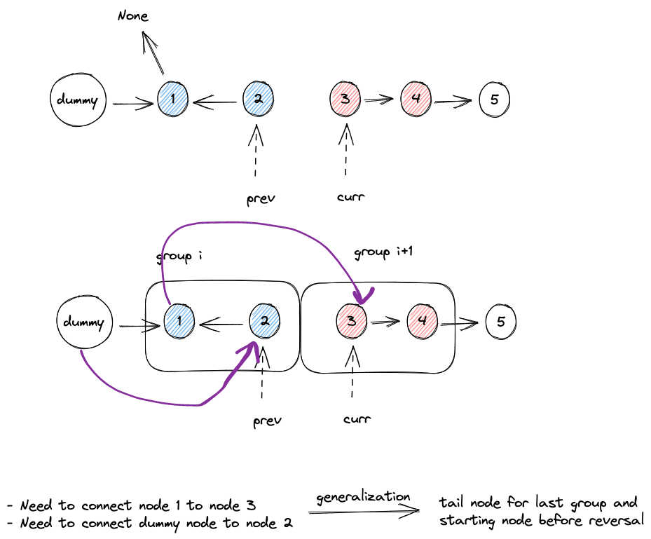

# Problem

Given the head of a linked list, reverse the nodes of the list k at a time, and return the modified list.

k is a positive integer and is less than or equal to the length of the linked list. If the number of nodes is not a multiple of k then left-out nodes, in the end, should remain as it is.

You may not alter the values in the list's nodes, only nodes themselves may be changed.

*Example 1:*


```
Input: head = [1,2,3,4,5], k = 2
Output: [2,1,4,3,5]
```

*Example 2:*


```
Input: head = [1,2,3,4,5], k = 3
Output: [3,2,1,4,5]
```

Constraints:

- The number of nodes in the list is `n`.
- `1 <= k <= n <= 5000`
- `0 <= Node.val <= 1000`


# Intuition

The problem is asking for reverse sub-linked list, in sub-groups. The first question is to determine the number of sub-groups. My train of thought is illustrated in the image below


To determine the length of linked list, we do this
```python
# step1: traver to get the length
dummy = ListNode(None,head)

ll_length = 0

curr = head
while curr:
    ll_length += 1
    curr = curr.next
```


After we determine the linked list length, we could easier get the **number of groups** and **number of left out nodes**

```python
# step2: compute necessary infos
num_of_groups = ll_length//k
num_of_left_out_nodes = ll_length%k
```

Since we need to reverse for every sub-group, there must exist a nested loop structure, 
```python
# iterate among all groups
for _ in range(num_of_groups):
            # iterate within the group
            for i in range(k):
```

Now, after we reverse our linked list classically, we need to do two things:
- connect dummy node with node 2
- connect node 1 with node 3



If we use more generalized form, for connecting and stitching `group i`, we need to
- connect the tail node of `group i-1` with the starting node after reversal
- connect the starting node of `group i` before traversal.

Summarize them and their updating strategy in the table
|variable name|description|initial condition|updating strategy|
|-|-|-|-|
|`last_group_tail_node`|-|`dummy`|`start_node`|
|`start_node`|-|`head`|`curr`|

> Note: 原来的`start_node`在reverse之后，变成了tail node of the sub-group.


# Code
```python
# Definition for singly-linked list.
# class ListNode:
#     def __init__(self, val=0, next=None):
#         self.val = val
#         self.next = next
class Solution:
    def reverseKGroup(self, head: Optional[ListNode], k: int) -> Optional[ListNode]:
        # step1: traver to get the length
        dummy = ListNode(None,head)
        
        ll_length = 0
        
        curr = head
        while curr:
            ll_length += 1
            curr = curr.next
        # step2: compute necessary infos
        num_of_groups = ll_length//k
        num_of_left_out_nodes = ll_length%k

        # step3:         
        curr = head
        last_group_tail_node = dummy 
        start_node = head
        for _ in range(num_of_groups):
            prev = None
            for i in range(k):
                temp = curr.next
                curr.next = prev
                prev = curr
                curr = temp
            
            last_group_tail_node.next = prev
            last_group_tail_node = start_node
            start_node.next = curr
            start_node = curr
            
        return dummy.next
```