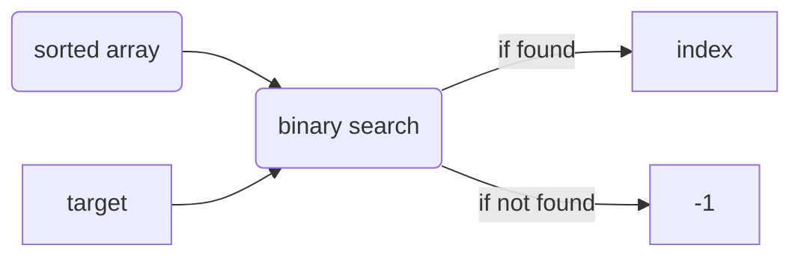

# Intuition
<!-- Describe your first thoughts on how to solve this problem. -->


 

# Approach
<!-- Describe your approach to solving the problem. -->

这题比较简单，唯一需要注意的是corner test cases like `nums = [4]` . termination of search space is `left > right` 

# Complexity
- Time complexity: $O(n)$
<!-- Add your time complexity here, e.g. $$O(n)$$ -->

- Space complexity: $O(1)$
<!-- Add your space complexity here, e.g. $$O(n)$$ -->

# Code
```pYthon
class Solution:
    def search(self, nums: List[int], target: int) -> int:
        # define left and right bound 
        left = 0
        right = len(nums) - 1

        while left <= right:
            # floor division
            mid = (right + left)//2 

            if nums[mid] == target:
                return mid

            elif nums[mid] > target:
                # targer is on the left of the mid, move right
                right = mid - 1
            else:
                # targer is on the right of the mid, move left
                left = mid + 1

        # if operation reaches here, target not in the array
        return -1
```