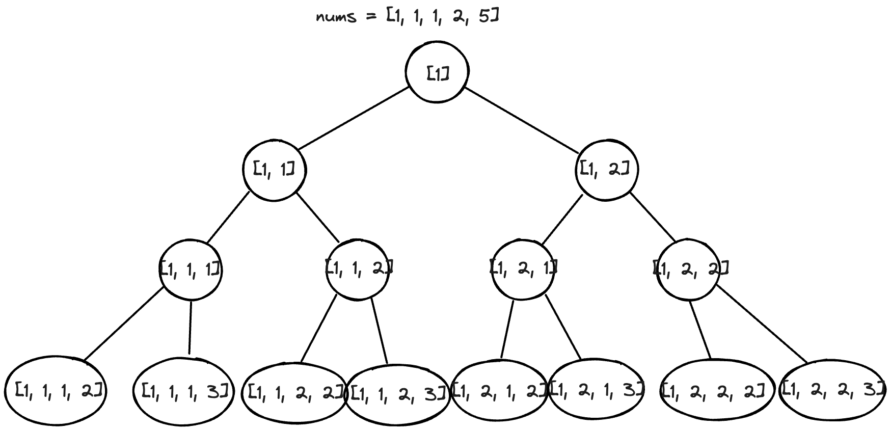

---
tags:
    - Dynamic Programming
    - Bucket Sort
---
# [Biweekly 124](https://leetcode.com/contest/biweekly-contest-124/)

2/4, 还是需要努力

## [1 Maximum Number of Operations With the Same Score I](https://leetcode.com/problems/maximum-number-of-operations-with-the-same-score-i/description/)

很简单的双指针题目.

```python
class Solution:
    def maxOperations(self, nums: List[int]) -> int:
        left,right = 0,1
        prev,curr = nums[left]+nums[right],0
        ans = 0
        while right < len(nums):
            curr = nums[left] + nums[right]
            if curr != prev:
                break
            # if reach here, it's the same
            ans += 1
            prev = curr
            left += 2
            right += 2
        return ans
```

## [2 Apply Operations to Make String Empty](https://leetcode.com/problems/apply-operations-to-make-string-empty/description/)

执行的operation是，删除第一个遇到的26个英文字符，然后问，在string边空之前，最后一个非空的字符是什么。假设n次operation, 会变成`""`, 其实就是求第n次操作删除了什么.

能留到最后的，也必定是出现次数最多的字符. 我直接联想到bucket sort, 建一个auxillary array, 然后从后往前traverse找到第一个非空, 然后break. 这一步只能保证我们获得最后一个非空的string里所有char, 不保证顺序。如果你最后是`abc`, 那么我的检索的结果会是`['a','c','b']` etc.

怎么保证获得这个顺序呢? 我又建了一个hashmap, 记录last non-empty string中每个char的出现次数。然后你traverse string, 如果这个char在hashmap里，那么就减少次数，如果次数为0，那么这就会是最后一个非空的char.


```python
from collections import defaultdict
class Solution:
    def lastNonEmptyString(self, s: str) -> str:
        # create a hashmap for char:occurence
        # based on occruence, do a bucket sort and traverse from the end
        hashmap = defaultdict(int)
        for c in s:
            hashmap[c] += 1
        
        buckets = [[] for _ in range(len(s)+1)]
        
        for char,occurence in hashmap.items():
            buckets[occurence].append(char)
        
        # now, we traverse from the end
        candidates = []
        for count in range(len(buckets)-1,-1,-1):
            if len(buckets[count]) != 0:
                for item in buckets[count]:
                    candidates.append(item)
                break
        
        # count will be the number of appearance, candidate will be 
        solution_map = dict()
        for candidate in candidates:
            solution_map[candidate] = count
        
        # edge case
        if count == 1:
            return "".join(candidates)
        
        
        # general case
        res = []
        for i in range(len(s)):
            if s[i] in solution_map:
                solution_map[s[i]] -= 1
                if solution_map[s[i]] == 0:
                    res.append(s[i])
        
        return "".join(res)
```

## [3 Maximum Number of Operations With the Same Score II](https://leetcode.com/problems/maximum-number-of-operations-with-the-same-score-ii/description/)

这题是3040, 也是第一题的变种. 但这次我们扩宽了operation的定义:

- choose the first two elements of `nums` and delete them
- choose the last two elements of `nums`  and delete them
- choose the first and the last elements of `nums` and delete them

求每次operation得分都一样时候，最多能进行多少次operation. 果然在打比赛的时候，大家都先想出来top-down. 

```python
class Solution:
    def maxOperations(self, nums: List[int]) -> int:
        @cache
        def f(arr,prev):
            # base case
            if len(arr)<2:
                return 0
            
            # 3 possible可能性
            sm1=arr[0]+arr[1]
            sm2=arr[-1]+arr[-2]
            sm3=arr[0]+arr[-1]
            ans=0
            
            if prev == sm1:
                ans = max(ans,1 + f(arr[2:],sm1))
            if prev == sm2:
                ans = max(ans,1 + f(arr[:-2],sm2))
            if prev == sm3:
                ans = max(ans,1 + f(arr[1:-1],sm3))
            
            return ans
        
        return max(f(tuple(nums[2:]),nums[0]+nums[1]),
                   f(tuple(nums[:-2]),nums[-1]+nums[-2]),
                   f(tuple(nums[1:-1]),nums[0]+nums[-1]))  + 1
```


## [4 Maximize Consecutive Elements in an Array After Modification](https://leetcode.com/problems/maximize-consecutive-elements-in-an-array-after-modification/description/)

[LC 3041](https://leetcode.com/contest/biweekly-contest-124/problems/maximize-consecutive-elements-in-an-array-after-modification/), 给你一个数组, 比如`[2,1,5,1,1]`, 你可以给any arbitrary number + 1, 然后让你**求连续最长的子数组**的长度. 

Example 1:

```
Input: nums = [2,1,5,1,1]
Output: 3
Explanation: We can increase the elements at indices 0 and 3. The resulting array is nums = [3,1,5,2,1].
We select the elements [3,1,5,2,1] and we sort them to obtain [1,2,3], which are consecutive.
It can be shown that we cannot select more than 3 consecutive elements.
```

Example 2:

```
Input: nums = [1,4,7,10]
Output: 1
Explanation: The maximum consecutive elements that we can select is 1.
```

这题我一开始有两个思路:

- 一个是根据每一个value, 向右辐散，然后找答案。但发现case不general, 无法求出
- 计算gap, 然后找gap为1的都是fillable的

两个思路都不对, 用dp和gap的不同来分类你的状态转移方程.


### Approach 1 DP by lee大神

$O(n) + O(nlogn)\approx O(nlogn)$ in time, O(n) in space.

[Lee](https://leetcode.com/lee215/) is crazy, his [Solution here](https://leetcode.com/problems/maximize-consecutive-elements-in-an-array-after-modification/discuss/4742395/JavaC%2B%2BPython-DP)

Constraints:

- `1 <= nums.length <= 10**5`
- `1 <= nums[i] <= 10**6`

我们的数组长度是$10^5$ and range is $10^6$, 所以我们直接构建一个为$10^6$为长度的hashmap (worst case scenario)，定义我们的dp. 

!!! note dp definition
    `dp[num]`:  maximum length of consecutive sequence **ending** with `num`. `num`是dp array的index, 也是nums中的值

这一步最关键是ending, 

!!! note initial condtion
    0 for all. 

Once we sort the array `nums`, each `num` in sorted `nums` can be updated like this 

- we use `num` as `num` itself, 因为我们可以不改变, `dp[num] = dp[num-1] + 1`
- we use `num` as `num + 1`, 因为我们可以加1，所以 `dp[num+1] = dp[num] + 1`

也就是一鱼两吃，一次双更新.


```python
class Solution:
    def maxSelectedElements(self, nums: List[int]) -> int:
        dp = collections.defaultdict(int)
        nums.sort()
        for num in nums:
            # update use num as num + 1 with the increment
            dp[num+1] = dp[num] + 1
            # update use num as num as num without increment
            dp[num] = dp[num-1] + 1
            
        return max(dp.values())
```

#### Q1: 为什么这个更新顺序work?

你如果换一下更新顺序，如下所示，是不会work的. 

```python
class Solution:
    def maxSelectedElements(self, nums: List[int]) -> int:
        dp = collections.defaultdict(int)
        nums.sort()
        for num in nums:
            # update use num as num as num without increment
            dp[num] = dp[num-1] + 1
            # update use num as num + 1 with the increment
            dp[num+1] = dp[num] + 1
            
        return max(dp.values())
```

因为这一步的更新是相对独立的，也就是说，你先更新了`dp[num]`, 你下一个公式又是依赖于`dp[num]`的值，所以你不能先更新`dp[num]`. 这两次更新，都是依赖于上一个时步.

#### Q2 为什么初始化为0而不是1?

这里很tricky的点是，你如果理解ending with `num`, 你可能至少为initialize为0. 但这样会让计算复杂化. 假设这个数组的return为0, 比如`[1,4,7,10]`, 那走过一遍

```python
for num in nums:
    dp[num+1] = dp[num] + 1
    dp[num] = dp[num-1] + 1
```

dp会是

```json
{
    "1":1,
    "2":1,
    "4":1,
    "5":1,
    "7":1,
    "8":1,
    "10":1,
    "11":1
}
```

其实就是变化之后的也考虑在里面了, 比如dp[2] == 1, 但是2不在nums里面是由1变化而来的. 所以这里初始化设为0 即可.再来一次dry run for `[1,1,1,2,5]`, dry run结果为下图,


#### Q3: 如何下次还能想到这个解法?

这个解法的关键是，你要理解ending with `num`, 这个是最关键的一步. 之后我也无能为力。他妈的，dp真难.画个decistion tree + 定义optimal substructure+ overlapping subproblem.



decision tree画完清晰多了吧，为什么我们是依赖于上一个时步的值，所以我们不能先更新`dp[num]`, 而是先更新`dp[num+1]`.

Then, 

- `optimal substructure`: 求这个问题, `[1,4,9,14]`的解，可以通过求`[1,4,9]`的解，以此类推的子问题到base case `[1]`吗? 可以的
- `overlapping subproblem`: 每个subproblem, 都包含了base case? Yes. 所以这题拥有overlapping subproblem.


### Space optimized

can you try?

```python

```