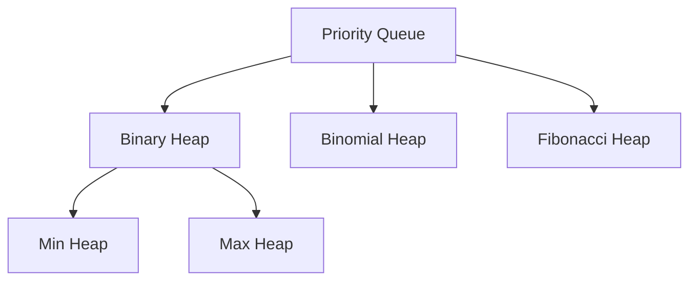

# Heap (堆)

## Heap的定义

> Heap is a special type of tree that
> 
> - **Complete Binary Tree**: all levels are filled except possibly the last level and filled from left to right. 为什么需要这个条件呢？因为这样可以用数组来表示heap，具体看下一个性质.
> - **parent-child relationship**: For a parent node at index `i` and its child nodes at index `2i+1` and `2i+2` (0-based index). 这个性质是为了方便用数组来表示heap, 见[Python](https://docs.python.org/3/library/heapq.html).
> - **Heap Property**: The maximum or minimum is always at the root. Also, value of each node is greater than or equal to the value of its children (max heap) or less than or equal to the value of its children (min heap)


Let's take a look at min heap to see how it works.

```
        1
      /   \
     2     3
    / \   / \
   4   5 6   7
```

Each child is greater than or equal to its parent. The root is the smallest value. It also satisfies the complete binary tree property. If we represent it in array, it would be

```python
nums = [1 2 3 4 5 6 7]
```

!!! note note
    `priority queue` is an abstract data structure like a blueprint while `heap` is a concrete implementation of priority queue. It can be min-heap or max-heap. Ppl usually use both terms interchangeably.

选择heap的主要原因是其

- Get the max/min value比较快. 对于一些需要频繁获取最大最小值的场景，heap是很好的candidate. 时间复杂度为$O(1) + O(\log n)\approx O(\log n)$. 属于`heappop()`的时间复杂度。
- For insertion, it's $O(\log n)$, which is also pretty good.

!!! tip
    为什么`heappop()`复杂度为O(1) + O(log n)? 因为`heappop()`是先pop出来，然后为了maintain heap property, 再调整heap的结构，后者时间复杂度是$O(\log n)$. 调整heap property是两部曲, 你pop走了，缺个root, 你先

    - replace the root with the last element in the heap
    - sift down the root node to maintain the heap property $O(h) = O(\log n)$


## Heap的应用场景

有以下几个应用场景:

- `jira ticketing system`: the ticket with the highest priority is always at the top. 这其实就是一种priority queue的应用.
- `patient scheduling`: the patient with the most severe condition is always at the top, 并不一定是first come first serve.


??? tip "Heap for Python Dev"
    If you using python, you just need to remember `from heapq import heapify, heappush, heappop` to use min heap. The syntax are
    - `heapify(list)`: convert a list into a heap
    - `heappush(heap, item)`: push an item onto the heap
    - `heappop(heap)`: pop the smallest item from the heap
    Python doesn't implement max heap by default but the hacky way would be pass in a negative version of the list to the heap and then pop it out and negate it.


## Heap找儿子和爸妈

Heap的一个重要性质是，可以用数组来表示heap. 为什么呢？因为heap是complete binary tree, 所以可以用数组来表示, 也就是满足如果你知道parent node's index, you can find its children's index.


$$
\begin{align}
l_{left} = 2i_p+1 \\
l_{right} = 2i_p+2
\end{align}
$$
where $i_p$ is the parent's index, $l_{left}$ is the left child's index, and $l_{right}$ is the right child's index.

!!! warning "思考题"
    所有的sorted array都是heap吗？所有的heap都是sorted array吗？

??? warning "思考题答案"
    所有的sorted array都是heap, 但是所有的heap都不是sorted array. 因为sorted array, 肯定满足儿子比爸爸大的性质。sorted array的constrains强一些, 相当于还要求heap的每一层，平辈的，从左到右都是有序的，这个性质不能保证所有的heap都能满足.

On the other hand, if you know the child's index, you can find its parent's index by

$$
\begin{equation}
i_p = \lfloor \frac{i_c-1}{2} \rfloor
\end{equation}
$$
where $i_c$ is the child's index (can be both left or right child)


## 相关题目

Heap的题目主要有以下几类:

- The top k problem
- The k-th largest/smallest element problem
- Heap sort (不考)

或者看见关键词, smallest, largest, minimal or maximal, top k, k-th, 就可以考虑用heap作为备选方案之一.

- [215 Kth Largest Element in an Array](https://leetcode.com/problems/kth-largest-element-in-an-array/description/) and [solution](../../leetcode/215-kth-largest-element-in-an-array/index.md).
- [973 K Closest Points to Origin](https://leetcode.com/problems/k-closest-points-to-origin/description/) and [solution](../../leetcode/973-K-closest-points-to-origin/index.md).

## References

这里附上一个全家福, 刷LC只需要知道binary heap就足够了.




- [geek4geek, good explanation](https://www.geeksforgeeks.org/introduction-to-heap-data-structure-and-algorithm-tutorials/?ref=lbp)