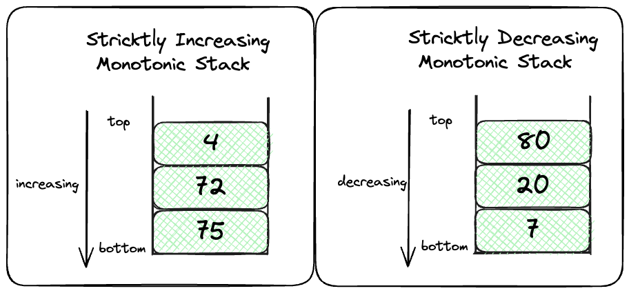

# Monotonic Stack (单调栈)

## 单调栈的定义

> `单调栈`是在`栈`LIFO的基础上，元素满足top to bottom是严格单调递增或者严格单调递减的。从上往下是单调递增的stack, 叫做`单调递增栈`，反之叫做`单调递减栈`.



??? Tip "单调栈的复杂度"
    单调栈的时间和空间复杂度是O(n), 你可能会误以为`for` nested with `while`, 但`while`只负责pop stack直到为空. `for`只负责塞进去. 如果循环完，最坏情况是, 每个元素都最多进栈一次，出栈一次, 一共n个元素，所以时间复杂度是O(n). 比如
    对于严格单调递增的，`nums = [1,2,3,4,5]`, 每个元素都进出一次.

## Monotonic Stack解决什么问题?

擅长解决nearest biggest or smallest element in an array的问题. 有以下几个例子，

- 比如说你有一个股票走势图, 记录了每一天每次股票价格的变化. 你想快速获得每一个点的, next greater value, 可以进行一些统计分析.


### 应用: Next Greater Element

找next greater element, 显然是要找个严格递增栈。Template 如下
```python
def monotoneIncreasingStack(nums):
    stack = []
    for num in nums:
        while stack and num >= stack[-1]:
            stack.pop()
        stack.append(num)
```

??? tip "严格和不严格的区别"
    严格递增栈是不会有相等的元素的，而非严格递增栈是可以有相等的元素的。所以严格递增栈需要剔除stack中相等的元素，即`num == stack[-1]`. 加之需要剔除stack中比新来的元素小的元素，即`num > stack[-1]`. 所以条件是`num >= stack[-1]:`在stack非空，都需要剔除

    - *严格递增栈*: `while stack and num >= stack[-1]:`
    - **递增栈**: `while stack and num > stack[-1]:` 

### 应用: Next Smaller Element

找next smaller element, 显然是要找个递减栈。Template 如下
```python
def monotoneDecreasingStack(nums):
    stack = []
    for num in nums:
        while stack and num <= stack[-1]:
            stack.pop()
        stack.append(num)

```


## 相关题目

- [LC 496 Next Greater Element I](https://leetcode.com/problems/next-greater-element-i/description/) and [solution](../../leetcode/496-next-greater-element-I/index.md)
    - 挺不错的入门题
- [LC 739. Daily Temperatures](https://leetcode.com/problems/daily-temperatures/description/) and [solution](../../leetcode/739-daily-temperatures/index.md).
    - 经典例题，入门题
- [LC 1762 Buildings With an Ocean View](https://leetcode.com/problems/buildings-with-an-ocean-view/description/) and [solution](../../leetcode/1762-buildings-with-an-ocean-view/index.md).
    - 入门题
## Reference

- [算法通关手册 Monotonic stack](https://algo.itcharge.cn/03.Stack/02.Monotone-Stack/01.Monotone-Stack/)
