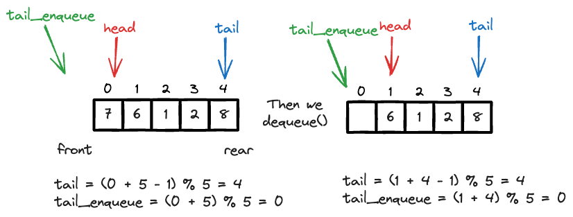

# Queue Implementation

Queue作为一种linear data structure, 一般有以下几种implementation方式:

- `Array-based queue`: 一般的实现方法，有一个drawback. 就是当queue满了之后，你dequeue from the top, 你就会有一个空间浪费的问题. 这时候你有两个选择，要么你增大array的size, 要么你shift整个array, 这两种方法都不是很好, 为了解决这个问题，引入了双指针来manipulate array创造所谓的**Circular Array-based Queue**.
    - [LC 622. Design Circular Queue](https://leetcode.com/problems/design-circular-queue/description/).
- `Linked List-based Queue`: 略
- `two stack emulation`: 用俩stack, 颠来倒去, 一个stack用来push, 一个stack用来pop, 这样就可以实现queue的FIFO特性了. 想象成一个spring coil or [tower of Hanoi](https://en.wikipedia.org/wiki/Tower_of_Hanoi). 这题可以看这里.
    - [LC 232. Implement Queue using Stacks](https://leetcode.com/problems/implement-queue-using-stacks/description/)


这三种方式的复杂度如下表:

| Operation | Array-based Queue | Linked List-based Queue | Two Stack Emulation |
| --------- | ------------------ | ------------------------ | ------------------- |
| Enqueue   | O(1)               | O(1)                     | O(1)                |
| Dequeue   | O(n)               | O(1)                     | O(n)                |
| Peek      | O(1)               | O(1)                     | O(n)                |


这里我们主要细讲一下`Array-based Queue`的实现方法.

## Circular Array-based Queue

先来看看构建这个queue, 我们需要:

- `self.queue`: 一个array, 用来存储queue的element
- `self.count`: 一个counter, 用来记录queue的element个数
- `self.capacity`: 一个int, 用来记录queue的最大容量
- `self.head`: 一个int, 永远指向queue的first element in the queue.

当有了这些关系，我们可以推算出tail pointer的位置

- `tail = (head + count - 1) % capacity`: 指向first available empty slot ready to be enqueued
- `tail_enqueue = (head + count - 1) % capacity`: 指向the last element in the queue (刚刚enqueue进来的).

`tail` points to the last item in the queue, 也就是刚刚enqueue进来的element. `tail_enqueue` points to the last available slot ready to be enqueued, 也就是"可以允许被覆盖的位置".

!!! tip Tip
    里面的`%`是取余数的意思, 也就是说，当我们的head在一端时，我们可以wrap around到另一端，这样就实现了circular queue的特性. 任何circular的特性，都可以解.

看下图来理解wrap around和two pointers technique, 



你从这里可以看到, 

```python
class MyCircularQueue:
    """
    Use array to implement "circular "queue. Imagine we have a full queue like 
    [1, 2, 3, 4 ,5 ]
    and we execute two dequeue() from the top. 
    [_, _, 3, 4 ,5 ]
    Now, we have some space near the head but we don't have space at the tail. 
    It will cause problem if we decide to enqueue(i), we will be
    - shifting everything to fill the empty space near head of the queue (O(n))
    - expand the fix-sized array, (create an array of size 2n, move to it, destroy the old array)
    """
    def __init__(self, k: int):
        self.queue = [0 for _ in range(k)]
        self.count = 0
        self.capacity = k
        # always points to the head of the queue
        self.head = 0
        
    def enQueue(self, value: int) -> bool:
        """
        Insert an element into the circular queue from tail. Return true if the operation
        is successful. Return false if the queue is maxed out.
        """
        if self.count == self.capacity:
            return False
        # last available slot ready to be enqueued
        tail_enqueue = (self.head + self.count) % self.capacity
        self.queue[tail_enqueue] = value
        self.count += 1
        return True

    def deQueue(self) -> bool:
        """
        Pop an element from the head. Return true if the operation is successful.
        Return false if the queue is empty
        """
        if self.count == 0:
            return False
        # remove the element at head
        self.head = (self.head + 1) % self.capacity
        self.count -= 1
        return True
        

    def Front(self) -> int:
        if self.count == 0:
            return -1
        return self.queue[self.head]
        

    def Rear(self) -> int:
        if self.count == 0:
            return -1
        # points to last item in the queue (who just enqueued)
        tail = (self.head + self.count - 1) % self.capacity
        return self.queue[tail]
        
    def isEmpty(self) -> bool:
        return self.count == 0

    def isFull(self) -> bool:
        return self.count == self.capacity
```

## Reference

