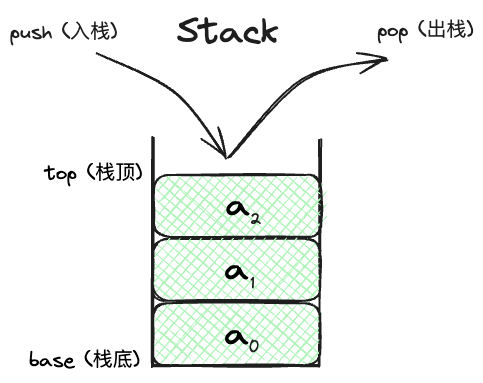

# Stack

## Stack的定义

> **Stack (堆栈)**: AKA 栈，是一种线性储存结构，是一种只允许在一端进行插入和删除操作的线性表。栈遵循LIFO（Last In First Out）原则，即最后进入的元素最先出来.

一个栈的示意图如下:



其中top是栈顶是唯一允许操作的一端，而base是栈底。栈底是固定的，而栈顶是动态的。stack有两个基本操作:

- `push(value)`: 将元素从top入栈
- `pop()`: 将栈顶元素出栈

它符合原则LIFO (Last In First Out)的线性表.

## Stack的应用

Stack应用非常广泛，属于扛把子级别的auxillary DS, 按分类可以理解为以下2类:

- very convenient save and access, 可以作为auxillary DS, 保存临时的信息, 用于快速访问. 比如
    - 浏览器的前进后退, 保存你的recently visited sites
    - undo operation in text editor, undo可以cancel你的operations and reverts to previous state. 这个previous state被保存在stack里面, 需要的时候在pop出来
    - 你的teammate开发了一个新feature, 希望你去看看branch, 然后你很刚好工作到一半，不好commit，所以你需要用[git stash](https://git-scm.com/docs/git-stash). `git stash`之后，去看了他的branch, 然后回来`git stash pop`，继续你的工作. 这个功能的实现就是通过stack来实现的.
- 根据LIFO, 轻松做到逆序, 比如
    - 翻转一组元素, 比如python negative slicing for reverse, `nums[::-1]`, 你可以用stack来实现

希望我说了这么多, 你能对stack加深印象, 并且能够在实际工作中应用.

## Stack的实现

stack有两种储存方式,

- **顺序储存**: 利用一组contiguous memory来依次储存bottom to top的元素, 同时维护一个pointer top, 永远指向栈顶元素. 是用数组实现的.
- **链式储存**: 用链表来实现, 每个节点有一个指针指向下一个节点. 元素按照插入顺序，依次插入到链表的第一个节点之前，并使用一个指针`top`指向新插入的节点. 这样新插入的节点就成为了栈顶元素. 方便插入和删除操作, 通常用单链表实现.

既然明白了stack的储存方式，我们就要看看我们一般实现stack的时候，需要实现哪些方法:

- `init()`: 初始化stack, 设计一个capacity (如果静态)以及初始化top指针.
- `is_empty()`: 判断stack是否为空
- `is_full()`: 判断stack是否满了
- `push(value)`: 将元素从top入栈
- `pop()`: 将栈顶元素出栈
- `peek()`: 返回栈顶元素，但不出栈.


接下来我们看看stack的实现，我们先看看顺序储存的实现.

### 方法1: 顺序储存的实现


!!! note 
     Python或者其它支持negative index的语言，可以不需要维护top, 直接用`stack[-1]`来表示栈顶元素. 但是为了更好的理解stack的实现，我们还是维护一个top指针.

```python
class Stack:
    def __init__(self, capacity):
        self.capacity = capacity
        self.stack = []
        # top指向last index, 现在是空的，所以initialize为-1
        self.top = -1
    
    def is_empty(self):
        return self.top == -1
    
    def is_full(self):
        return self.top == self.capacity - 1
    
    def push(self, value):
        if self.is_full():
            raise Exception("Stack is full")
        self.stack.append(value)
        self.top += 1
    
    def pop(self):
        if self.is_empty():
            raise Exception("Stack is empty")
        self.top -= 1
        return self.stack.pop()
    
    def peek(self):
        if self.is_empty():
            raise Exception("Stack is empty")
        return self.stack[self.top]
```

### 方法2: 链式储存的实现


```python
class Node:
    def __init__(self, value):
        self.value = value
        self.next = None
        
class Stack:
    # 初始化空栈
    def __init__(self):
        self.top = None
    
    # 判断栈是否为空
    def is_empty(self):
        return self.top == None
    
    # 入栈操作
    def push(self, value):
        cur = Node(value)
        cur.next = self.top
        self.top = cur
    
    # 出栈操作
    def pop(self):
        if self.is_empty():
            raise Exception('Stack is empty')
        else:
            cur = self.top
            self.top = self.top.next
            del cur
    
    # 获取栈顶元素
    def peek(self):
        if self.is_empty():
            raise Exception('Stack is empty')
        else:
            return self.top.value
```

## 经典题目: [LC. 20 Valid Parentheses](https://leetcode.com/problems/valid-parentheses/description/)

很经典的一题.

!!! note "Anecdote"
    这个题目第一次做还是在上海的一家星巴克on [codewars](https://www.codewars.com/kata/52774a314c2333f0a7000688)等鸡仔,好像是梅龙镇吧，那时候只能想出来暴力解，我取名为`while`的抓娃娃大法.


## 相关题目

- [LC. 225 Implement Stack using Queues](https://leetcode.com/problems/implement-stack-using-queues/description/) and solution here
- [LC. 227 Basic Calculator II](https://leetcode.com/problems/basic-calculator-ii/description/) and solution here


## Reference

- [北航算法通关手册](https://algo.itcharge.cn/03.Stack/01.Stack-Basic/01.Stack-Basic/#_3-1-%E6%8B%AC%E5%8F%B7%E5%8C%B9%E9%85%8D%E9%97%AE%E9%A2%98)
- Book: DSA by Goodrich