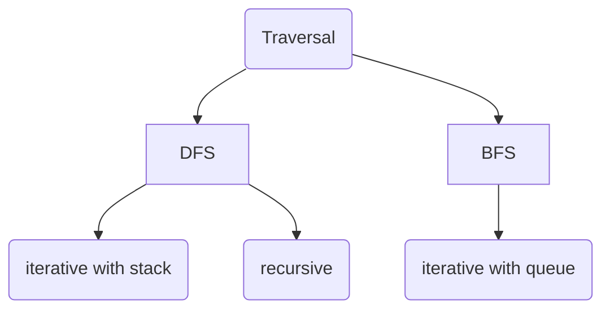

# Tree Problems

Tree的题型分成以下几类:

1. Tree Traversal
2. 结构转换树, serialize/deserialize
    - `serialize`: 把树转换成线性的list
    - `deserialize`: 把list转换成树
3. LCA (lowest common ancestor)
    - ??
4. BST (binary search tree)
5. iterator
    - 亚麻喜欢考

## Traversal

Traversal是最基础的树的题型, 其分类大体为:

对于DFS来说，无论是iterative还是recursive, 都需要somehow go back to the nodes visited before, 所以要么需要一个explicit stack来存储 (iterative DFS), 要么需要一个recursive call stack来存储 (recursive DFS).

|number|类型|思路|solution|
|---|---|---|---|
|[144 Binary Tree Preorder Traversal](https://leetcode.com/problems/binary-tree-preorder-traversal/description/)|DFS|`[root,left,right]`|[solution](../../leetcode/144-binary-tree-preorder-traversal/index.md)|
|[94 Binary Tree Inorder Traversal](https://leetcode.com/problems/binary-tree-inorder-traversal/description/)|DFS|`[left,mid,right]`|[solution](../../leetcode/94-binary-tree-inorder-traversal/index.md)|
|[145 Binary Tree Postorder Traversal](https://leetcode.com/problems/binary-tree-postorder-traversal/description/)|DFS|镜像之术, `[left,right,root]` <--> reverse of `[root,right,left]`. 也就是preorder traversal但是调换一下左右先访问的顺序|[solution](../../leetcode/145-binary-tree-postorder-traversal/index.md)|
|[102 Binary Tree Level Order Traversal](https://leetcode.com/problems/binary-tree-level-order-traversal/description/)|BFS|BFS入门|[solution](../../leetcode/102-binary-tree-level-order-traversal/index.md)|
|[107 Binary Tree Level Order Traversal II](https://leetcode.com/problems/binary-tree-level-order-traversal-ii/description/)|BFS|uno reverse card|[solution](../../leetcode/107-binary-tree-level-order-traversal-II/index.md)|
|[103 Binary Tree Zigzag Level Order Traversal](https://leetcode.com/problems/binary-tree-zigzag-level-order-traversal/description/)|BFS|maintain `flip = True` and `flip = not flip` on each level即可|[solution](../../leetcode/103-binary-tree-zigzag-level-order-traversal/index.md)|
|[314 Binary Tree Vertical Order Traversal](https://leetcode.com/problems/binary-tree-vertical-order-traversal/description/)|BFS|2D matrix for tree, intuition是tree traversal中, 路过left child, matrix往左扩展1，路过right child, 往右扩展1， 可以通过这个性质知道matrix的span|[solution](../../leetcode/314-binary-tree-vertical-order-traversal/index.md)|

!!! warning
    还有些advanced traversal method, 如Morris Traversal, 但是不常考, 也不是必须的.

## 结构转换树, serialize/deserialize

|number|类型|思路|solution|
|---|---|---|---|
|297 Serialize and Deserialize Binary Tree|
|428 Serialize and Deserialize N-ary Tree|
|449 Serialize and Deserialize BST|
|1008 Construct Binary Search Tree from Preorder Traversal|
|105 Construct Binary Tree from Preorder and Inorder Traversal|
|106 Construct Binary Tree from Inorder and Postorder Traversal|
|889 Construct Binary Tree from Preorder and Postorder Traversal|
|426 Convert Binary Search Tree to Sorted Doubly Linked List|

## BST

|number|类型|思路|solution|
|---|---|---|---|
|270 Closest Binary Search Tree Value|
|450 Delete Node in a BST|
|98 Validate Binary Search Tree|
|173 Binary Search Tree Iterator|
|426 Convert Binary Search Tree to Sorted Doubly Linked List|
|99 Recover Binary Search Tree|
|108 Convert Sorted Array to Binary Search Tree|
|95 Unique Binary Search Trees II|
|96 Unique Binary Search Trees|

## LCA

|number|类型|思路|solution|
|---|---|---|---|
|235 Lowest Common Ancestor of a Binary Search Tree|
|236 Lowest Common Ancestor of a Binary Tree|
|1644 Lowest Common Ancestor of a Binary Tree II|
|1650 Lowest Common Ancestor of a Binary Tree III|
|1676 Lowest Common Ancestor of a Binary Tree IV|
|1123 Lowest Common Ancestor of Deepest Leaves|

## 信息传递

|number|类型|思路|solution|
|---|---|---|---|
|257 Binary Tree Paths|
|1148 Count Good Nodes in Binary Tree|
|124 Binary Tree Maximum Path Sum|
|1120 Maximum Average Subtree|
|1372 Longest ZigZag Path in a Binary Tree|
|1123 Lowest Common Ancestor of Deepest Leaves|
|549 Binary Tree Longest Consecutive Sequence II|

