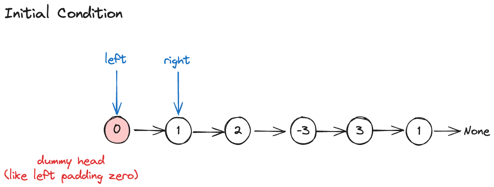

---
tags:
    - Linked List
    - Hash Table
---

# [1171 Remove Zero Sum Consecutive Nodes from Linked List](https://leetcode.com/problems/remove-zero-sum-consecutive-nodes-from-linked-list/description/?envType=daily-question&envId=2024-03-12)

Take home from this question

- how to enumerate subsequence in a linked list using two pointers and while loop 
- how to use dummy head node to simplify the boundary condition

## Approach 1 Brute Force

Brute force solution will be enumerating all possible subsequence and check if the sum of those subsequence is equal to 0. If it is, then we remove the subsequence from the list. In order to enumerate subsequence in a linked list, we have to

- initialize a dummy head node and point it to the head of the linked list
- initialize a left and right pointer, where left is the start of the subsequence and right is the end of the subsequence. It's left hand exclusive ,right hand inclusive `(left, right]`

!!! warning "Effect of dummy head node"
    没有dummy head node, 我们需要考虑boundary的特殊情况以及interior nodes的情况, 有了dummy head node, 我们可以统一处理所有的情况 as interior nodes. In the context of insertion and deletion in linked list, it's always easier to have a dummy head node. 而这一题是enumerating subsequence + deletion, 所以dummy head node也是highly suggested.

如下图所示, `left` pointer points at dummy head node, `right` pointer points at the first node of the linked list. 




enumerate结果如下

- first round: [1], [1,2], [1,2,-3], [1,2,-3,3], [1,2,-3,3,1]
- second round: [2], [2,-3], [2,-3,3], [2,-3,3,1]
- ...以第三个元素开始


### Code Implementation

```python
# Definition for singly-linked list.
# class ListNode:
#     def __init__(self, val=0, next=None):
#         self.val = val
#         self.next = next
class Solution:
    def removeZeroSumSublists(self, head: Optional[ListNode]) -> Optional[ListNode]:
        # all subarray's sum that equal to zero
        dummy = ListNode(0,head)
        left = dummy

        # O(n^2) (start,end]
        while left is not None:
            # reset the prefix
            prefix_sum = 0
            right = left.next

            while right is not None:
                prefix_sum += right.val
                # delete consecutive sequence that sum up to 0
                if prefix_sum == 0:
                    left.next = right.next
                right = right.next
            # move to next start
            left = left.next
        return dummy.next
```


## Approach 2 Prefix Sum Hash Table

如下图，如果我们计算prefix sum,


|prefix sum|1|5|8|5|10|16|
|-|-|-|-|-|-|-|
|node value|1️|4|3|-3|5|6|

我们发现有两个prefix sum是相同的，那么这两个prefix sum之间的subsequence sum up to 0.


有了这个发现，我们可以把find subsequence sum up to 0的问题转化为find duplicate prefix sum的问题。我们可以用hash table来存储prefix sum以及对应的node。为什么优先选择hash table

- 天然的deduplication of prefix sum as key space is unique
- 这样我们就可以在O(1)的时间内找到duplicate prefix sum对应的node。不需要traverse it again.

对于linked list，
```python
nums = [1,4,-3,1,2,5,6]

prefix_map = {
    0: dummy,
    1: ListNode(1),
    5: ListNode(2), #原来是5: ListNode(4), 但被覆盖了
    2: listNode(-3),
    3: ListNode(1),
    10: ListNode(5), 
    16: ListNode(6),
}
```


### Code Implementation (two pass)

```python
# Definition for singly-linked list.
# class ListNode:
#     def __init__(self, val=0, next=None):
#         self.val = val
#         self.next = next
class Solution:
    def removeZeroSumSublists(self, head: Optional[ListNode]) -> Optional[ListNode]:
        dummy = ListNode(0,head)
        curr = dummy
        # initialize     
        prefix_sum = 0
        prefix_sum_to_node = {0:curr}

        # initial compute for pre-fix sum
        while curr is not None:
            prefix_sum += curr.val            
            # 如果已经在里面了，我们只记录最新的那个prefix sum
            prefix_sum_to_node[prefix_sum] = curr
            curr = curr.next
        
        prefix_sum = 0
        curr = dummy

        # delete zero sum consecutive sequences
        while curr is not None:
            # 计算target prefix sum, 再去找怎样能到达这个prefix sum的node
            prefix_sum += curr.val
            # curr: last node before the zero sum sequence
            # prefix_sum_to_node[prefix_sum].next: first node after the zero sum sequence
            curr.next = prefix_sum_to_node[prefix_sum].next
            curr = curr.next
        
        return dummy.next
```


### Code Implementation (one pass)

我的大脑无法思考了.

```python
class Solution:
    def removeZeroSumSublists(self, head: Optional[ListNode]) -> Optional[ListNode]:
        front = ListNode(0, head)
        current = front
        prefix_sum = 0
        prefix_sum_to_node = {}
        while current is not None:
            # Add current's value to the prefix sum
            prefix_sum += current.val

            # If prefix_sum is already in the hashmap,
            # we have found a zero-sum sequence:
            if prefix_sum in prefix_sum_to_node:
                prev = prefix_sum_to_node[prefix_sum]
                current = prev.next

                # Delete zero sum nodes from hashmap
                # to prevent incorrect deletions from linked list
                p = prefix_sum + current.val
                while p != prefix_sum:
                    del prefix_sum_to_node[p]
                    current = current.next
                    p += current.val

                # Make connection from the node before 
                # the zero sum sequence to the node after
                prev.next = current.next
            else:
                # Add new prefix_sum to hashmap
                prefix_sum_to_node[prefix_sum] = current

            # Progress to next element in list
            current = current.next

        return front.next
```
