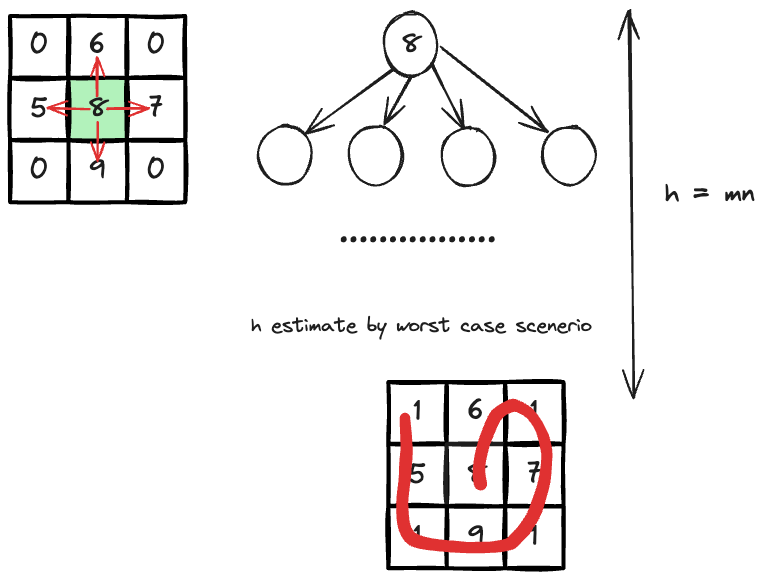

---
tags:
    - Backtracking
    - Array
    - Matrix
    - Breadth First Search
    - Depth First Search
---

# [1219 Path With Maximum Gold](https://leetcode.com/problems/path-with-maximum-gold/description/?envType=daily-question&envId=2024-05-14)

很经典的一道graph的题目. 有几个局部小优化:

- `gold_upper_bound = sum(sum(row) for row in grid)`是这题的upper bound, 一旦reach, 就可以直接返回了

这题强推DFS解法，因为比BFS少维护一个queue.

## Approach 1 DFS with Backtracking

这题首先有几个特点:

- start from any cell with gold
- can't go into cell without gold
- can't visit a cell more than once

由于是要maximize the gold, 这样的就是优化问题，这又是图的问题，所以我们有几个思路:

- 考虑greedy吗?
- 考虑caching with DP吗?
- 暴力dfs or bfs?

!!! tip "why not greedy or DP?"

    - greedy: 由于贪心算法是不走回头路的，我们每一步都走四个neighbor中最大的，很容易举出反例，所以greedy不work.
    - DP: 比如`dp(r,c)`, the maximum gold pick-up starting from cell `(r,c)`, 你会发现这两个系数`r,c`并不足够描述我们的状态，因为我们还需要一个额外的状态来记录我们是否走过这个cell，而这个状态是不好用argument来描述的，所以不考虑DP. (ideal gas law $pv = nrt$, 你可以用p and v or p and t来锁定热力学状态，但如果你当前的状态取决于你之前压力，温度等的变化曲线，这就变得非常难以描述，前置状态变得无穷多，就非常expensive, 等升华为概率based like [boltzman equation](https://en.wikipedia.org/wiki/Boltzmann%27s_entropy_formula))
    
所以我们只能用暴力dfs or bfs. 其复杂度为:

- $O(mn4^{mn})$ in time
- O(mn) in space if not allowing modifying the input grid, otherwise O(1)



### Code Implementation (in-place)

```python
class Solution:
    def getMaximumGold(self, grid: List[List[int]]) -> int:
        """
        observation
        - start from any cell with gold
        - can't go into cell without gold
        - can't visit a cell more than once
        """
        max_gold = 0
        DIFF = [(1,0),(-1,0),(0,1),(0,-1)]
        ROWS,COLS = len(grid),len(grid[0])
        def dfs(row,col):
            # base case: out of bound or zero in cell
            if row < 0 or col < 0 or row == ROWS or col == COLS or grid[row][col] == 0:
                return 0
            
            # grab the initial gold amount and mark the cell -> 0
            initial_gold = grid[row][col]
            max_gold = grid[row][col]
            grid[row][col] = 0

            # recursive call
            for i,j in DIFF:
                max_gold = max(max_gold,initial_gold + dfs(i + row,j + col))
            
            # set the cell back
            grid[row][col] = initial_gold
            return max_gold 

        for r in range(ROWS):
            for c in range(COLS):
                max_gold = max(max_gold,dfs(r,c))
                    
                    
        return max_gold
```

### Code Implementation (with extra space)

```python
from collections import deque
class Solution:
    def getMaximumGold(self, grid: List[List[int]]) -> int:
        """
        observation
        - start from any cell with gold
        - can't go into cell without gold
        - can't visit a cell more than once
        """
        max_gold = 0
        DIFF = [(1,0),(-1,0),(0,1),(0,-1)]
        ROWS,COLS = len(grid),len(grid[0])
        def dfs(row,col,visited):
            # base case: out of bound or zero in cell
            if row < 0 or col < 0 or row == ROWS or col == COLS or grid[row][col] == 0 or (row,col) in visited:
                return 0
            
            # grab the initial gold amount and mark the cell -> 0            
            max_gold = grid[row][col]
            visited.add((row,col))

            # recursive call
            for i,j in DIFF:
                max_gold = max(max_gold,grid[row][col] + dfs(i + row,j + col,visited))
            
            # set the cell back
            visited.remove((row,col))
            return max_gold 

        for r in range(ROWS):
            for c in range(COLS):
                max_gold = max(max_gold,dfs(r,c,set()))
                                    
        return max_gold
```

## Approach 2 BFS

不太建议BFS，特别是在interview setting, 因为需要额外维护一个queue, 不仅浪费空间，还要多很多enque和deque的操作.

```python
from collections import deque
class Solution:
    def getMaximumGold(self, grid: List[List[int]]) -> int:
        """
        observation
        - start from any cell with gold
        - can't go into cell without gold
        - can't visit a cell more than once
        """
        max_gold = 0
        DIFF = [(1,0),(-1,0),(0,1),(0,-1)]
        ROWS,COLS = len(grid),len(grid[0])
        def bfs(row,col):                        
            # grab the initial gold amount and mark the cell -> 0            
            max_gold = 0
            visited = set()
            visited.add((row,col))
            queue = deque()
            queue.append((row,col,grid[row][col],visited))
            
            while queue:
                curr_r,curr_c,curr_gold,curr_visited = queue.popleft()  
                max_gold = max(max_gold,curr_gold)                                  
                for i,j in DIFF:
                    next_r = curr_r + i
                    next_c = curr_c + j

                    # check if in-bound
                    if min(next_r,next_c) >=0 \
                    and next_r < ROWS \
                    and next_c < COLS \
                    and grid[next_r][next_c] != 0 \
                    and (next_r,next_c) not in curr_visited:

                        curr_visited.add((next_r,next_c))
                        queue.append((next_r,next_c,\
                                        curr_gold + grid[next_r][next_c],\
                                        curr_visited.copy()))
                        curr_visited.remove((next_r,next_c))
                    
            return max_gold

        gold_upper_bound = sum(sum(row) for row in grid)

        for r in range(ROWS):
            for c in range(COLS):
                if grid[r][c] != 0:
                    max_gold = max(max_gold,bfs(r,c))
                if max_gold == gold_upper_bound:
                    return gold_upper_bound
                                        
        return max_gold
```


## Reference

- [Neetcode 3:40 on why not DP for this problem?](https://www.youtube.com/watch?v=I1wllM_pozY&ab_channel=NeetCodeIO)