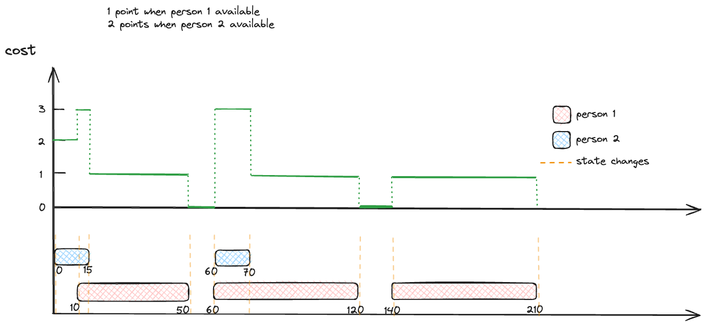

---
tags:
    - Array
    - Two Pointers
    - Sorting
---

# 1229 Meeting Scheduler

首先先理解这一题，这俩人有空的时间段`list1` and `list2`是输入, 我们要找他们overlapping的时间段中，足够他俩讨论的时间段。这个时间段的长度至少是`duration`. 如果有多个时间段满足条件，我们返回最早的那个。如下图，


第一反应就是line sweep, 把所有时间点放进一个list, 排序后准备进行line sweep.

## Approach 1 Line Sweep

对于sweep line, 我们只需要构建出能够描述系统内所有状态的cost function即可，假设

- person 1有空时为+1
- person 2有空时为+2

这样我们可以把finite的四种状态给描述出来

- person 1有空，person 2有空, `cost == 3`
- person 1有空, person 2没空, `cost == 1`
- person 1没空, person 2有空, `cost == 2`
- person 1没空, person 2没空, `cost == 0`

我们把`slots1` and `slots2` flatten成一个list of tuples, 然后sort by time. 这样我们就可以用sweep line的方法来找到所有的interval where both people are available. 有两个关键时间点:

- curr_sum == 3 and prev_sum != 3, 这个时候我们可以开始一个新的interval
- curr_sum != 3 and prev_sum == 3, 这个时候我们可以结束一个interval

根据这个就能判定出来怎么插入了, 如下图



```python
class Solution:
    def minAvailableDuration(self, slots1: List[List[int]], slots2: List[List[int]], duration: int) -> List[int]:
        # brute force, O(m*n)
        """
        1.
        assign
            person 1 as +1
            person 2 as +2
            no person available as 0
            person1 and 2 are both available + 3
        1. find intervals that both people are available
        [[10,15],[60,70]]
        2. see the first one has it's length greater than duration
        """
        times = []
        for start,end in slots1:
            times.append((start,1))
            times.append((end,-1))
        
        for start,end in slots2:
            times.append((start,2))
            times.append((end,-2))
        # sort by time aescendingly
        times.sort(key = lambda x:x[0])

        intervals = []
        curr_sum = 0
        prev_time = -1

        for time,cost in times:
            # update prev
            prev_sum = curr_sum            
            # update new ones
            curr_sum += cost
            
            if prev_sum != 3 and curr_sum == 3:
                # both are available, going into it
                intervals.append([time])
            elif prev_sum == 3 and curr_sum != 3:
                # ending the availability
                intervals[-1].append(time)            
            prev_time = time
        
        if not intervals:
            return []
        else:
            for start,end in intervals:
                if end - start >= duration:
                    return [start,start + duration]
        
        return []
```