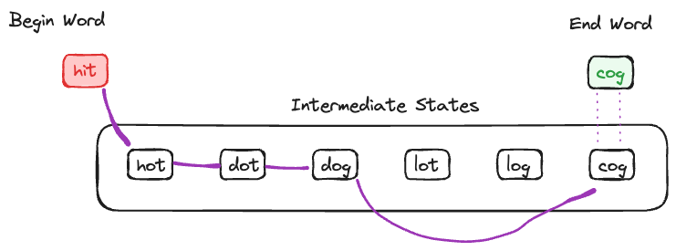
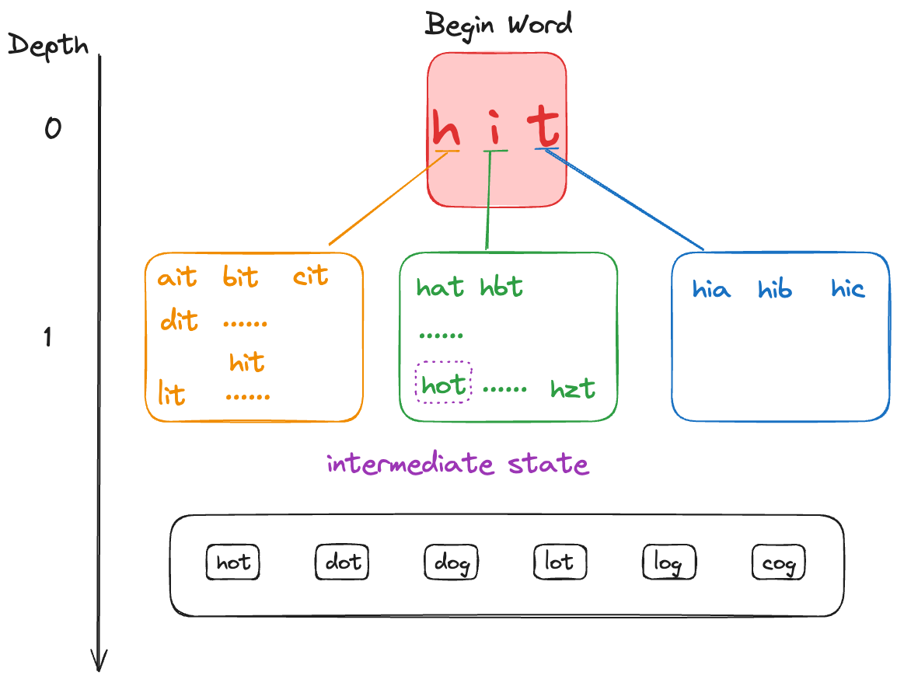

---
tags:
    - Breadth-First Search
    - Hash Table
    - String
---

# [127 Word Ladder](https://leetcode.com/problems/word-ladder/description/)

## Problem

A transformation sequence from word beginWord to word endWord using a dictionary wordList is a sequence of words,
> beginWord -> s1 -> s2 -> ... -> sk such that:

- Every adjacent pair of words differs by a single letter.
- Every `si` for 1 <= i <= k is in wordList. Note that beginWord does not need to be in wordList.
- `sk == endWord`

Given two words, beginWord and endWord, and a dictionary wordList, return the number of words in the shortest transformation sequence from beginWord to endWord, or 0 if no such sequence exists.

**Example 1**
```
Input: 
beginWord = "hit", 
endWord = "cog", 
wordList = ["hot","dot","dog","lot","log","cog"]

Output: 5
Explanation: One shortest transformation sequence is "hit" -> "hot" -> "dot" -> "dog" -> cog", which is 5 words long.
```


## Intuition

The question is asking for the minimum number of steps required to turn `beginWord` into `endWord`. Each step you can only change 1 character, and all intermediate characters has to be within `wordList` (including `endWord`, excluding `beginWord`), illustrated in the diagram below,





We notice that `hit` and `cog` are completely different, and if we can transition from `hit` to `cog` without the constrain of intermediate states being in `wordList`, the minimum operation required is 3. But with the constrain, it becomes a search problem, the search space between each consecutive search is $O(l\times 26)$, where $l$ is length of word, like a tree, shown in the diagram below,




!!! note
    One really important thing is that we never look back. That means if we explore one intermediate state, we don't ever go back to this state again otherwise we won't find minimum depth or we can get stuck in infinite cycle.


This problem has two approaches,

|-|time complexity|space complexity|
|-|-|-|
|Approach 1 BFS|$O(n26^{l})$|$O(n)$|
|Approach 2 BFS bi-directional|$O(n26^{\frac{l}{2}})$|$O(n)$|

where $n$ is the length of `wordList`, $l$ is the length of `wordList[i]`


## Approach 1 BFS

```python
from collections import deque
class Solution:
    def ladderLength(self, beginWord: str, endWord: str, wordList: List[str]) -> int:
        """
        # of different char compared with wordList
        beginWord_diff = [1,2,3,2,3,3]
        endWord_diff = [2,2,1,2,1,0]

        we know our end.

        Find the depth of the BFS
        """
        word_set = set(wordList)
        # edge case
        if endWord not in word_set:
            return 0

        q = collections.deque([beginWord])
        n = len(beginWord)
        depth = 1

        while q:
            size = len(q)
            depth += 1

            for _ in range(size):
                curr = q.popleft()
                
                if curr in word_set:
                    word_set.remove(curr)                                        
                # brute force 3 x n
                for i in range(n):
                    for j in range(26):
                        # right hand exclusive
                        candidate = curr[:i] + chr(ord('a')+j) + curr[i+1:]
                
                        # O(n), compare if two string are the same
                        if candidate == endWord:
                            return depth
                        
                        if candidate in word_set:
                            q.append(candidate)
                            word_set.remove(candidate)
        return 0
```

## Approach 1 BFS-bidirectional


## Reference

- [huahua](https://www.youtube.com/watch?v=vWPCm69MSfs&ab_channel=HuaHua)