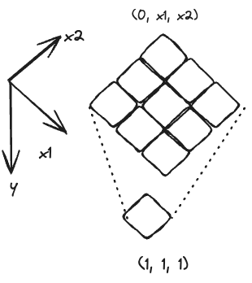

---
tags:
    - Array
    - Matrix
    - Dynamic Programming
---
# [1463 Cherry Pickup II](https://leetcode.com/problems/cherry-pickup-ii/description/?envType=daily-question&envId=2024-02-11)

这题作为湾区三俗(采摘, hiking, 狼人杀)，是相当有意思的2维DP的题目. 这一题我们会探索, 

- 不同的DP的状态定义, 导致的解法不同. i.e. 从上往下走和从下往上走的区别.


## Approach 1 DP

这一题的既然是求最大能拿到多少cherries, 那就是优化问题，那么我们可以尝试用DP来解决，那么先看看, 

- `optimal substructure`: 最后目标是走到最后一行n的最优解，可以通过求n-1行的最优解，再increment by one step的最优解来得到. 这也就是第一个子问题. 同理，可以递推到第一行
- `overlapping subproblems`: 这个问题可以分解为, 
  - 求解n-1行的最优解
  - 求解n-2行的最优解
  - ...
  - 第一行的初始条件
  - 其中每一步都需要求解求base的子问题，也就是第二行的最优解，所以是有重叠的子问题的.

!!! note Note
    - Time complexity: $O(rc^2)$
    - Space complexity: $O(rc^2)$

任何dp问题都是一个decision tree, 假设我们只看一个机器人，如下图,


也就是每一层node,最多有三个children, 一共有r层，所以时间复杂度是$O(3^r)$. 但这一题是两个机器人，所以这个decision tree更复杂，每一个node有9个childing, 分别对应着, state$s_{ij}$
$$
\begin{equation}
    s_{ij} \quad i,j \in [左上,上方，右上]
\end{equation}
$$
where $i$ and $j$ are the position of the two robots. 对于每一个格子的状态，总计需要9个来描述。所以需要$O(9^r)$的时间复杂度, 如果用decision tree.


!!! tip Tip
    其实和ideal gas law中$PV = nRT$中你只需要两个变量，P和V (intrinsic state variables)来描述一个气体的状态一样，这里也需要描述一个格子的状态，只需要两个变量，$i$和$j$来描述一个格子的状态. 但区别是pressure和volume是scalar, 而这里的$i$和$j$是vector罢了, 所以需要9个来描述一个格子的状态.

那如果我们把整体状态描述的话，需要`(y,x1,x2)` 来描述一个状态，其中`y`是行数，`x1`和`x2`是两个机器人的位置来枚举所有的状态, 这其实就是一个三维矩阵. 所以你需要$O(rc^2)$的时间复杂度来储存你的3D matrix. 
治愈更新这个状态，你需要上一个row的至多9个lattice的值来进行更新. 所以总计你需要, $O(9rc^2)$ time complexity来更新你的状态. 总结一下,

- time complexity $O(9rc^2)$的更新你的全部状态
- space complexity $O(rc^2)$来储存你的状态

信息流动如下图, 




### DP的information propagation方向

现在我们有了一个3D的状态矩阵，我们需要考虑的是，我们的信息是如何传播的. 也就是我们的DP的方向是如何的, 有两种可能，

- `从上往下`: initial condition很明确, 只有`dp[0][0][c-1]`和`dp[0][c-1][0]`是有值的，其他的都是0.
- `从下往上`: 反着推，已知结果往上推.

这一题我们选择`从下往上`的方向，因为从上往下推的话，最后我们机器人可以end up在任何一个位置，也就是

|method|description|solution|
|-|-|-|
|从上往下|两个机器人，一个站在左上`grid[0][0]`, 另一个站在右上`dp[0][c-1]`，那么initial condition是`dp[0][0][c-1] = grid[0][c-1] + grid[0][0]`|由于机器人可以到任何一个位置，所以说你的最大值是arbitrary in the last slice of the 3d array, 也就在一个2维matrix里，`dp[c-1][x1][x2]`, 这个二维空间大小为$c^2$|
|从下往上|由于机器人可以在任何位置，所以你只需要用暴力枚举`O(cc)`种可能性即可|由于俩机器人一定在左上和右上，答案必然在`dp[0][0][c-1]`|

现在开始dp三件套吧. 由此我们可以看到，用`从下往上`的方向，就不需要求了，因为我们的答案一定在`dp[0][0][c-1]`这个位置，所以我们选择这个方法来求一遍.


我们来看一个,`从上往下`的例子, 我们看一下一个grid of 5x7的information propagation会在一个7x7x5的3d矩阵里,不断向下更新, 如下图所示


红色的cell代表着上一层的最优解，绿色的cell代表正在求的最优解，绿色的cell的值是由上一层的最优解 + 当前格子的值来的. 换句话说，你当前的`dp[i][x_1][x_2]`，要到达这里， 至多只有9种可能性，也就是你的上一层的最优解的9个lattice的值.

### DP三件套

#### DP状态定义
$dp[y][x_1][x_2]$:

- the maximum number of cherries that can be picked up when the first robot is at $grid[y][x_1]$ and the second robot is at $grid[y][x_2]$ where $y < len(grid) = r$ and $x_1,x_2 < len(grid[0]) = c$

#### DP的initial condition

由于是从下往上propagate, 所以从最后一行`r-1`开始

$$
\begin{equation}
dp[r-1][x_1][x_2] = \begin{cases}
    grid[r-1][x_1] + grid[r-1][x_1] \quad \text{if }x_1 \neq x_2\\
    grid[r-1][x_1] \quad \text{if }x_1 = x_2
\end{cases}
\end{equation}
$$

#### DP的状态转移方程

$$
\begin{equation}
dp[y][x_1][x_2] = \begin{cases}
    max\left(dp[y+1][x_1+i][x_2+j]\right) + grid[y][x_1] + grid[y][x_1] \quad \text{if }x_1 \neq x_2 \\
    max\left(dp[y+1][x_1+i][x_2+j]\right) grid[y][x_1] \quad \text{if }x_1 = x_2
\end{cases}
\end{equation}
$$

where $max\left(dp[y+1][x_1+i][x_2+j]\right)$ is the cartesian product of 9 states of two robots, and $i\in[-1,0,1]$ and $j\in[-1,0,1]$

接下来就是把这个代码写出来即可.

### Code Implementation

```python
class Solution:
    def cherryPickup(self, grid: List[List[int]]) -> int:
        # dp[r][x1][x2]        
        r,c = len(grid),len(grid[0])
        
        # space O(r*c^2)
        dp = [[[0 for _ in range(c)] for _ in range(c)] for _ in range(r)]

        # initial condition, cartesian product of r-1,x1,x2
        for i in range(c):
            for j in range(c):
                dp[r-1][i][j] = grid[r-1][i] + grid[r-1][j] if i != j else grid[r-1][i]

        for y in range(r-2,-1,-1):
            for x_1 in range(c):
                for x_2 in range(c):
                    temp = []
                    for i in range(-1,2,1):
                        for j in range(-1,2,1):
                            if 0 <= x_1 + i < c and 0 <= x_2 + j < c:
                                temp.append(dp[y+1][x_1+i][x_2+j])
                    
                    curr_max = max(temp)
                    # update
                    dp[y][x_1][x_2] = grid[y][x_1] + grid[y][x_2] if x_1 != x_2 else grid[y][x_1]
                    dp[y][x_1][x_2] += curr_max
                    
                            
        return dp[0][0][c-1]
```


## Approach 2 DP, space optimized

我们发现，其实我们的状态转移方程中，我们只需要上一层的状态来更新当前的状态，所以我们可以优化我们的空间复杂度，只需要一个rolling 2D的矩阵即可.

!!! note Note
    - Time complexity: $O(rc^2)$
    - Space complexity: $O(c^2)$


## Reference
- [花花酱, 依然简练](https://www.youtube.com/watch?v=Et-7IP5-6wA&ab_channel=HuaHua)