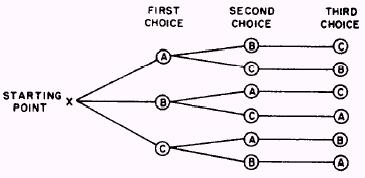

---
tags:
    - Backtracking
    - String
    - Hash Table
---

# 17 Letter Combination of a Phone Number

Very classic combination tree problem ,




## Approach 1 Brute force

The first solution pops in my head is this one.

```python
class Solution:
    def letterCombinations(self, digits: str) -> List[str]:
        res = []
        if not digits:
            return res
        
        mapping = {
            "2": "abc",
            "3": "def",
            "4": "ghi",
            "5": "jkl",
            "6": "mno",
            "7": "pqrs",
            "8": "tuv",
            "9": "wxyz",
        }
        
        res = [c for c in mapping[digits[0]]]
        
        for digit in digits[1:]:
            temp = []
            for prefix in res:
                for suffix in mapping[digit]:
                    temp.append(prefix + suffix)
            res = temp
        return res
```

## Approach 2 Backtracking

- `Time Complexity`: $O(3^{N}N)$, 3 is the average value in hte mapping, N is the length of digits, max to 4.
- `Space Complexity`: Recursive call stack $O(N)$


```python
class Solution:
    def letterCombinations(self, digits: str) -> List[str]:
        """
        input
        "2"
        ----------------------------------------
                        []
            "a"         "b"          "c"                1st choice
        
        input:
        "23"
        ----------------------------------------
                        []
            "a"         "b"          "c"                1st choice
        "d" "e" "d"  "d" "e" "d"  "d" "e" "d"           2nd choice                                                        
        """
        if not digits:
            return []

        mapping = {
            "2": "abc",
            "3": "def",
            "4": "ghi",
            "5": "jkl",
            "6": "mno",
            "7": "pqrs",
            "8": "tuv",
            "9": "wxyz",
        }
        
        def backtrack(i,path):
            """
            i: height, max to 4.
            path: for "23", it could be ["a","d"], ["a","e"]
            """
            # base case: are we at bottom yet
            if len(path) == len(digits):
                res.append("".join(path))
                return
            
            # 1: "abc" 
            candidate_letters = mapping[digits[i]]

            for letter in candidate_letters:
                # from [] to ["a"]; 
                path.append(letter)
                backtrack(i+1,path)
                # go back 1 layer
                path.pop()
        
        res = []
        
        backtrack(i = 0,path = [])
        return res        
```

## Approach 3 BFS


