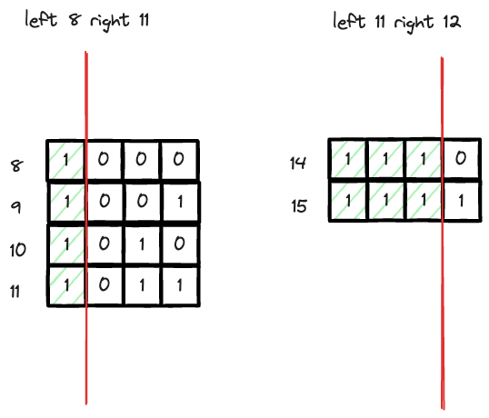

---
tags:
    - Bit Manipulation
---
# [201 Bitwise AND of Numbers Range](https://leetcode.com/problems/bitwise-and-of-numbers-range/description/)


这题要理解


## Approach 1 Common prefix

这题的理解, Bit都是假的，主要的是还是找规律和identify pattern. 这一题的pattern是find the common prefix.



只不过不像traverse string, 这里是traverse bit. 用的是bitwise shift罢了.

```python
class Solution:
    def rangeBitwiseAnd(self, left: int, right: int) -> int:
        counter = 0
        while left != right:
            left = left >> 1
            right = right >> 1
            counter += 1
        # now, left and right are equal
        return left << counter
```


