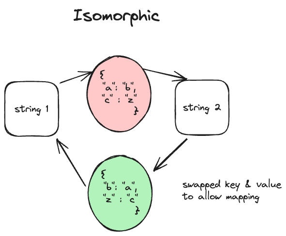

---
tags:
    - Hash Table
    - String
---

# [205 Isomorphic Strings](https://leetcode.com/problems/isomorphic-strings/description/?envType=daily-question&envId=2024-04-02)

If two strings are isomorphic, then it exists a hashmap that maps one character to another character such that it can map the first string to the second string, as illustrated in the figure below,



## Approach 1

```python
class Solution:
    def isIsomorphic(self, s: str, t: str) -> bool:
        
        def oneWayMapping(str1,str2):
            stringHash = {}
            # traverse the string and initialize the hash        
            for i in range(len(s)):
                # check if collision happens
                if str1[i] in stringHash:
                    if stringHash[str1[i]] != str2[i]:
                        return False
                # build the mapping
                stringHash[str1[i]] = str2[i]
            return True
        
        return oneWayMapping(s,t) and oneWayMapping(t,s)
```