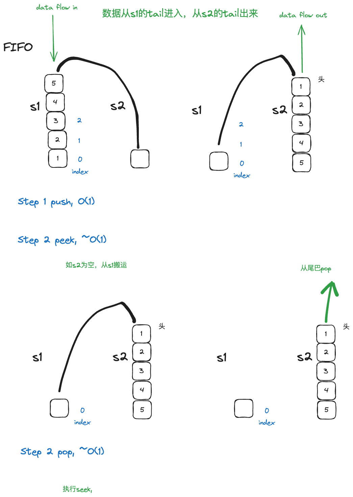

- [Intuition](#intuition)
- [Approach1: O(n) in push, O(1) in pop](#approach1-on-in-push-o1-in-pop)
- [Approach 2: O(1) in push, O(1) in pop](#approach-2-o1-in-push-o1-in-pop)

# Intuition

The question ask for implementing a queue using stacks. The key point is to use existing methods of stacks to simulate the queue.先来复习一下stack和queue的区别


> peek()method名字，为看一下马上要被pop or dequeue出去的元素是什么，但是不会真的pop出去

# Approach1: O(n) in push, O(1) in pop

因为要用2个stack来模拟queue，所以在push的时候，
- 需要把s1里的元素都pop出来，push到s2里，
- 然后再把新元素push到s2里，
- 最后再把s2里的元素都pop出来，push到s1里。

其它的functionality like pop or peek, 就是直接操作s1即可.

最难的push, 你可以抽象成spring coil like, s1是左边弹簧，你先把它移动到右边s2, 你加入新元素，你再移动回来


Approach 1具体图解如下


```python
class MyQueue:
    def __init__(self):
        self.s1 = []
        self.s2 = []
        
    def push(self, x: int) -> None:
        while self.s1:
            self.s2.append(self.s1.pop())
        self.s1.append(x)
        while self.s2:
            self.s1.append(self.s2.pop())
        
    def pop(self) -> int:
        return self.s1.pop()

    def peek(self) -> int:
        return self.s1[-1]
        
    def empty(self) -> bool:
        return not self.s1
        

# Your MyQueue object will be instantiated and called as such:
# obj = MyQueue()
# obj.push(x)
# param_2 = obj.pop()
# param_3 = obj.peek()
# param_4 = obj.empty()
```

# Approach 2: O(1) in push, O(1) in pop

这个有点tricky, 
- 利用s1的tail, 来模拟queue的tail, 进行enqueue
- 利用s2的tail, 来模拟queue的head, 进行dequeue and peek



```python
class MyQueue:
    def __init__(self):
        self.s1 = []
        self.s2 = []
        
    def push(self, x: int) -> None:
        self.s1.append(x)
        
    def pop(self) -> int:
        self.peek()
        return self.s2.pop()

    def peek(self) -> int:
        # when s2 is empty
        if not self.s2:
            while self.s1:
                self.s2.append(self.s1.pop())        
        return self.s2[-1]
        
    def empty(self) -> bool:
        return not self.s1 and not self.s2
```
