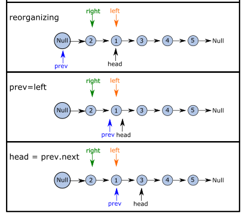
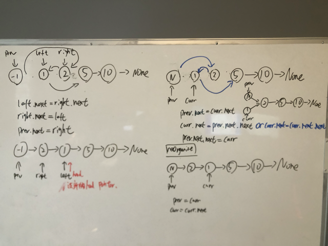

---
tags:
    - Linked List
    - Recursion
---

# 24 Swap Nodes in Pairs

## Approach 1: recursion approach

```python
# Definition for singly-linked list.
# class ListNode:
#     def __init__(self, val=0, next=None):
#         self.val = val
#         self.next = next
class Solution:
    def swapPairs(self, head: Optional[ListNode]) -> Optional[ListNode]:
        # base case
        if not head or not head.next:
            return head
        
        # define node to be swapped
        first_node = head
        second_node = head.next

        # swapping
        first_node.next = self.swapPairs(second_node.next)
        second_node.next = first_node

        return second_node
```


## Approach 2: iteration approach (use of three pointer)
<!-- Describe your approach to solving the problem. -->

我一开始的写的代码没有考虑到rejoining previous node with newly swapped node.只考虑了用two pointer swap.


swapping elements in array下意识的想到两点：

- two pointer technique

swapping elements in linked list, 要考虑到rejoining,

- 3 pointer technique


swapping and rejoining phase图解


update pointer图解, 要知道swap node之后，pointer `left` and `right` 还是指向原来的node, 所以随着node位置的改变，也在改变.




!!! note "complexity"

    - Time complexity: $O(n)$, you only scan once
    - Space complexity: $O(1)$

### Code
```python
# Definition for singly-linked list.
class ListNode:
    def __init__(self, val=0, next=None):
        self.val = val
        self.next = next
class Solution:
    def swapPairs(self, head: Optional[ListNode]) -> Optional[ListNode]:
        # three pointer technique, 在swap的时候，需要第三个pointer

        # check for edge cases
        if head is None or head.next is None:
            return head
        
        # set up a dummy node 
        dummy = ListNode(None)
        dummy.next = head

        # initialze three nodes
        prev = dummy
        
        while head and head.next:
            # advanced left and right node from the
            left = head
            right = head.next

            # swap nodes and rejoin
            left.next = right.next
            right.next = left
            prev.next = right

            # update the prev and head node for the next time step
            prev = left
            head = prev.next
            
            
            # update head to the new position
        return dummy.next

```
## Code(iteration with only two pointer)
这个比较巧妙，节约了一个pointer, 但我并不推荐，因为会让代码看起来更复杂,和three pointer method有一个区别:
- `while head and head.next` in three pointer, `while curr and curr.next` in two pointer, 前者是需要不断update `prev` and `head` pointer所以才判定`while head`, 后者是只update `curr` and `prev`. 本质上差不多, 但用前者的方法，head pointer由于不断update, 会指向`None`, 也就是改变了input.


具体图解如下,左边是three pointer, 右边只用了俩pointer



代码如下
```python
# Definition for singly-linked list.
class ListNode:
    def __init__(self, val=0, next=None):
        self.val = val
        self.next = next
class Solution:
    def swapPairs(self, head: Optional[ListNode]) -> Optional[ListNode]:
        # set up a dummy ListNode
        dummyNode = ListNode(None)
        dummyNode.next = head

        # set up two pointers for swapping and rejoining
        prev = dummyNode
        curr = head

        # 假设dummy node为node0, 之后的node命名为node1,2,3...
        while curr and curr.next:
            # 直接开始swap了 

            # connect node0 with node 2
            prev.next = curr.next
            # connect node 1 with node 3
            curr.next = prev.next.next
            # connect node 2 with node 1
            prev.next.next = curr
            # end: 现在的顺序是 node 0, node 2, node 1 and curr points to node 1

            # reset pointer for next time step
            prev = curr
            curr = curr.next

        return dummyNode.next

```


