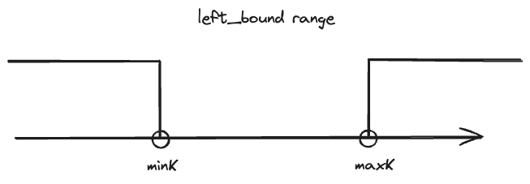

---
tags:
    - Array
    - Queue
    - Sliding Window
    - Monotonic Queue
---

# [2444 Count Subarrays With Fixed Bounds](https://leetcode.com/problems/count-subarrays-with-fixed-bounds/description/?envType=daily-question&envId=2024-03-31)


!!! warning "反思"
    比赛时的错误是想, 我想到了monotonic queue or heap, 但我选择了heap+hashmap的方式来解决，但被怎么pop historical heap properly给卡住了. hard的sliding window, 在constrains为$10^5$, 首先还是考虑O(n)解法，那么就只可能是monotonic queue or sliding window with two pointers了. 

## Approach 1 Sliding Window

Hard级别的sliding window, 通常involve three pointers, 且每一个子问题通常involve被三指针分割后的subarray进行manipulation. 这题维护的三指针是:

- `left_bound`: 用来记录不valid的subarray的左边界，也就是遇到value outside of minK and maxK的时候，我们需要将left_bound更新到当前的right. 这一步的原因是，我们并不保证minK and maxK是array-level的min和max, 所以有可能有比其更大或更小的数.
- `min_position`: 用来记录most recent value == minK的index
- `max_position`: 用来记录most recent value == maxK的index



通过上述三指针，我们可以分解子问题,每一步又可以分成两个小问题 (n*2个total):

- 在以0位结尾的index之中，找出符合条件的最大subarray - 符合条件的最小subarray
- 在以1位结尾的index之中，找出符合条件的最大subarray - 符合条件的最小subarray
- ...
- 在以n-1位结尾的index之中，找出符合条件的最大subarray - 符合条件的最小subarray

rephrase一下我们的子问题:

- 以0为结尾的subarray中，
    - 找出一个最大的array such that 这个array中的min and max is `minK` and `maxK` respectively
    - 找出一个最小的array such that 这个array中的min and max is `minK` and `maxK` respectively
- 以1为结尾的subarray中，
    - 找出一个最大的array such that 这个array中的min and max is `minK` and `maxK` respectively
    - 找出一个最小的array such that 这个array中的min and max is `minK` and `maxK` respectively
- ...


最大的array可以用`left_bound`来计算，最小的array可以用most recent `min_position` and `max_position`来计算.


At `right = 10`的图解如下,


### Code Implementation

```python
class Solution:
    def countSubarrays(self, nums: List[int], minK: int, maxK: int) -> int:
        """
        observation:
        - 没有提minK and maxK are array-level min and max, 所以有可能有比其更大或更小的数
        Break it down:
        - find the maximum subarray ending at index 0 that the max and min of this subarray is equal to minK and maxK
        """
        res = 0
        left_bound = -1
        min_position = max_position = -1

        for right,num in enumerate(nums):
            # we found outside, we remove them all
            if num < minK or num > maxK:
                left_bound = right
            
            if num == minK:
                min_position = right
            if num == maxK:
                max_position = right
            
            res += max(0,min(min_position,max_position) - left_bound)
        
        return res
```