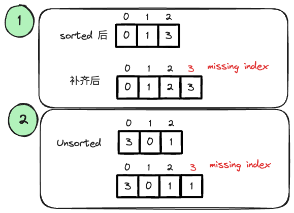
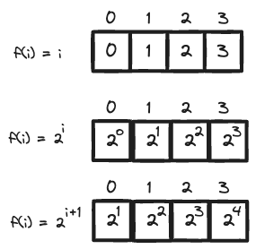

---
tags:
    - Array
    - Hash Table
    - Bit Manipulation
    - Sorting
    - Math
---

# 268 Missing Number

这题解法很多,

- sorting
- hashmap
- bit manipulation (optimal)
- rolling sum (optimal)

重点理解bit manipulation的解法，因为这个解法是O(n) time, O(1) space的解法. 这题利用的性质是XOR的性质 `a^a=0`, `a^0=a`. 和自然数 `0,1,2,...,n`存在array之中后，index和value是一样的性质. 这个想法可以generalize到更广义的array情况.


## Approach 1: Hash Table

想到思路是用hashset来存储所有现有的数字, 然后我们知道我们expected的数字是`0,1,2,...,n`, 所以我们可以从0开始往后找, 如果找到了一个数字不在hashset里面, 那么就返回这个数字.

这个解法要考虑一个
```python
class Solution:
    def missingNumber(self, nums: List[int]) -> int:
        # gaussian
        nums_set = set(nums)
        n = len(nums)

        # scan through candidate's lower and upper bound
        lower,upper = 0, n
        while lower<=upper:
            if lower not in nums_set:
                return lower
            lower += 1
```

## Approach 2: Sorting

同理，我们可以先sort这个数组，然后比较从0开始的expected数字和sort后的数组，如果有不一样的，那么就返回这个数字.

```python
class Solution:
    def missingNumber(self, nums: List[int]) -> int:
        nums.sort()
        
        expected = 0
        for num in nums:
            if num != expected:
                return expected
            expected += 1
        
        # if reaches here, missing last val
        return expected
```

## Follow-up: solve it with O(n) time, O(1) space

### Approach 3: Bit Manipulation

这题正好用刚学的bit manipulation的技巧来解决，我们知道`XOR`的性质是，`a^a=0`, 所以我们可以用`XOR`来解决这个问题. 我们先来思考下图的第一个框, 



假设我们有一个sorted `nums = [0,1,3]`, 我们要把它补齐，就需要

- 扩容array size by 1, 那最大的index为n.
- 找到missing value
- shift 所有的数字，腾出空间
- replace missing value

补齐之后的array是`[0,1,2,3]`, 注意到了吗? index == array. 这个性质可以用来解决这个问题. 我们可以用`XOR`来解决这个问题. 既然我们知道`XOR`的性质是`a^a=0`, 我们还缺一个missing value和一个最大index `n`, 那么我们把这些都连续`XOR`一下，就能得到missing value了.

再来看下图的第二个框,因为`XOR`有交换率，所以order doesn't matter if we scan entire array. 用这个例子

```
Input: nums = [3,0,1]
Output: 2
Explanation: n = 3 since there are 3 numbers, so all numbers are in the range [0,3]. 2 is the missing number in the range since it does not appear in nums.
```

我们初始化我们的missing index为`n = len(nums)`, 然后我们开始遍历整个数组，我们用`XOR`来更新missing index, `missing_i ^= i ^ val`, 如下方程展开,

$$
\begin{align}
\text{missing value} &= 3 \oplus (0 \oplus 3) \oplus (1 \oplus 0) \oplus (2 \oplus 1)\\
                     &= (0 \oplus 0) \oplus (1 \oplus 1) \oplus 2 \oplus (3 \oplus 3)\\
                     &= 0 \oplus 0 \oplus 2 \oplus 0\\
                     &= 2
\end{align}
$$

```python
class Solution:
    def missingNumber(self, nums: List[int]) -> int:
        # if we have n = len(nums), then the value ranging from 0... n-1
        # we now that if it's sorted, the complete nums will be index == values
        # index ^ value == 0, 现在再加上distributive law, 我们可以再分配

        missing_i = len(nums)
        for i,val in enumerate(nums):
            missing_i ^= i ^ val
        
        return missing_i
```


### Approach 4: Math (Gauss' Formula)

高斯求和公式for 等差数列，首项+末项*项数/2. 步骤如下

- 根据$0,1,2,...,n$的等差数列求和公式，求出$0,1,2,...,n$的和
- 遍历数组，减去数组中的每一个数
- 最后剩下的就是missing number

但第一步，我们可以不用memorize式，反正我们都是要linear solution, 直接rolling both actual sum and expected sum就好了.

```python
class Solution:
    def missingNumber(self, nums: List[int]) -> int:
        # gaussian
        expected_sum = 0
        actual_sum = 0
        rolling = 1
        for num in nums:
            actual_sum += num
            expected_sum += rolling
            rolling += 1
        return expected_sum - actual_sum
```


## 思考: XOR

除了`index == val`时, 任何val能用index表示出来的形式，都可以. 如下图所示, 



你只需要写出反函数，把val转化为index就好了.