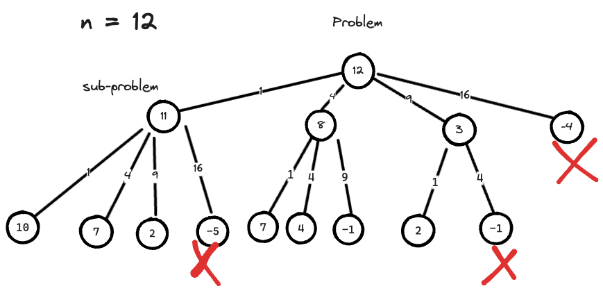

---
tags:
    - Dynamic Programming
    - Math
    - Breadth-First Search
---
# 279 Perfect Squares

## Approach 0: Brute Force

Assuming we have perfect squares, $a_n = n^2$ 
```
Perfect squares: 1, 4, 9, 16, 25, 36, 49... 
```
Given target `n`, 我们需要求的是最少的perfect squares的个数来满足这些之和等于`n`.

$$
\begin{align}
n &= n_1 a_1 + n_2 a_2 + n_3 a_3 + ... + n_i a_i \\
 &= n_{1} 1^2 + n_{2} 2^2 + n_{3} 3^2 + ... + n_{i} i^2 \\
 &= n_{1} 1 + n_{2} 4 + n_{3} 9 + ... + n_{i} i^2
\end{align}
$$

where $n_i$ is the number for the perfect square $a_i$, and $a_n$ the perfect square itself.

先来个暴力搜索, 如果我们从0, 开始不断加上, 如下图所示


你会发现，到第三层，就已经有很多重复性计算了，有重复性计算就有优化空间，而且求的是least (代表求极值问题)，那也就是一个优化问题, 优化问题就有太多了method了，但这个问题可以分解为子问题，如下图,



所以可能性只有两种，dp or greedy.

### 贪心 vs 动态规划
优化问题有两种可能:
- 贪心
- 动态规划

这里必然是动态规划, 因为贪心是每一步保证最优，而且贪心不需要回溯，举个例题中的例子, 
```
input: n = 12
output: 3
explain: 12 = 4 + 4 + 4
```

如果是贪心, 必然是每一步都选择最大的perfect square, 第一步就选择$3^2$, $12 - 9 = 3$, 第二步只能走$1^2$, $3 - 1 = 2$, 第三和第四步也一样，最后答案是4 (9, 4, 1, 1)并不是最优解.

排出了贪心，答案必定是动态规划，那么我们就可以开始分析动态规划的解法了.

## Approach 1: DP bottom-up

### DP definition
DP is defined as, 
```
dp[i]: the least number of perfect squares numbers that sum to i
```
### Initialization

all the values in array `dp` are initialized to `n`, except `dp[0] = 0`. 0 is just the padding left boundary for the array.

### State Transition Function

我们知道以下规律,如果求n, 那么
```
dp[0] = 0
dp[1] = 1
dp[2] = 2
dp[3] = 3
dp[4] = 1
...
```
这之间的依赖关系其实是, recall the graph, 每往下推一步，都依赖于上一步存在的结果，而每一层中间的差值，正好是一个perfect square, 我们是从上往下推的
```
dp[下一层结果] = dp[上一层结果] + 1
上一层结果 - perfect square = 下一层结果
```

具体如下图所示：


`DP[12]` 也就是我们要求的价值，依赖于`DP[11]`, `DP[8]` and `DP[3]`, 而为什么是`3, 8, 11`呢，是由`12 - perfect square`得到的，所以我们可以得到状态转移方程如下：

$$
dp[i] = \min_{1 \leq s \leq i} \{ dp[i - s^2] + 1 \} \quad \forall \quad i - s^2 \geq 0
$$

接下来我们只需要不断从下往上推即可.

```python
class Solution:
    def numSquares(self, n: int) -> int:
        # DP[i]: the least number of perfect squares numbers that sum to i
        # initialization:
        # DP[0...n] == n, DP[0] = 0
        # 1^2 + 1^2 + ... + 1^2 = 12 * 1^2 = 12
        # state transition function (could propogate from multiple fronts)

        DP = [n for _ in range(n+1)]
        DP[0] = 0

        # 被减数(target) - square = remaining
        for target in range(1, n + 1):
            for s in range(1, target + 1):
                square = s * s
                remaining = target - square 
                if remaining < 0:
                    break
                # propogate
                DP[target] = min(DP[target], 1 + DP[remaining])

        return DP[n]
```