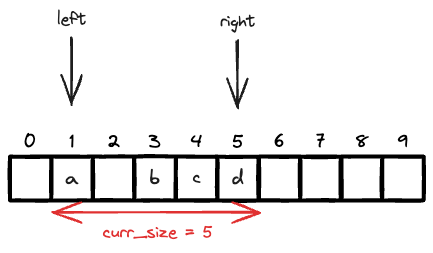
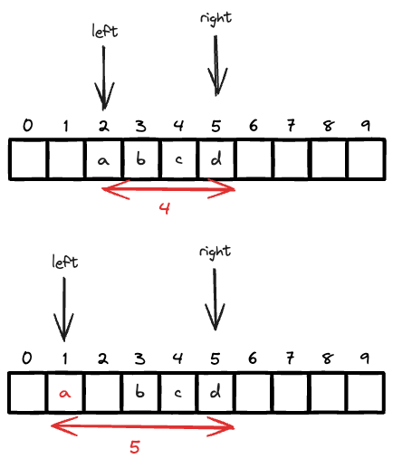

# [3085 Minimum Deletions to Make String K-Speical](https://leetcode.com/problems/minimum-deletions-to-make-string-k-special/description/)

Contest的时候没有想出来，想的是bucket sort + sliding window来不断缩小区间.

## [Approach 1 LEE215](https://leetcode.com/problems/minimum-deletions-to-make-string-k-special/solutions/4886312/java-c-python-enumerate-minimum-frequency)

lee215太强了。解法思路如下, 通过观察可以得到以下几个推论:

- bucket sort之后，delete最小的frequency, window往右移动直到遇到非空
- delete最大的frequency, window左移动一格

具体如下图所示,

- 如果删掉`'a'`,  我们的windows size decreses from 5 to 3 (有一个空格)
- 如果删掉`'d'`,  我们的windows size decreses from 5 to 4



也就是说，我们减去左边最低的频率，性价比是最高的，因为这样可以最大限度的减少删除的字符数。但右边的频率每次减少1都会导致window size减少1。但这个并不能帮助我们确定到底是挪左边还是右边. 所以这里，我们使用枚举的方法, 暴力求解。但这里就不能转化为值域，用bucket sort了. 看下面的例子,

```python
word = "dabdcbdcdcd"
k = 2
counter = {
    "a":1,
    "b":2,
    "c":3,
    "d":5
}
```

由于一共只有24个字母，所以我们暴力枚举也只是24*24次，所以是可以接受的。但我们枚举的时候要计算什么呢? 我们需要计算的是以下四种情况，

- 当完全不删除`a`的时候，多少次操作才能删到window size为2.
- 当完全不删除`b`的时候，多少次操作才能删到window size为2.
- 当完全不删除`c`的时候，多少次操作才能删到window size为2.
- 当完全不删除`d`的时候，多少次操作才能删到window size为2.

答案必定在这四个值中，所以我们可以枚举这四个值，然后取最小值即可。那会不会有，

- 我删除了1个`a`, 但是我`a`还是最后的window的左边界的情况呢?

答案是否定的，因为你delete最小的频率的字母by one，那么你的window的左边界往左移动by one, 最后你window反而变大了, 如下图。所以这情况不可能



所以得出结论，最优解必然在完全不删除某个字母的情况下获得。我们接下来只需要计算成本即可.

### Code Implementation
```python
from collections import Counter
class Solution:
    def minimumDeletions(self, word: str, k: int) -> int:
        counter = Counter(word).values()
        res = float('inf')

        for min_freq in counter:
            cost = 0
            for freq in counter:
                # 比min_freq小的，全删除                
                if freq < min_freq:
                    cost += freq
                
                # 比min_freq大且freq - min_freq > 2，
                # 删until min_freq + k. So move from freq --> min_freq + k
                if freq >= min_freq + k:
                    cost += freq - (min_freq + k)
            res = min(res,cost)

        return res        
```


