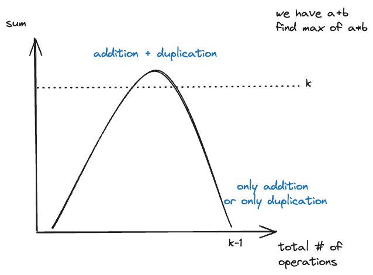

---
tags:
    - Greedy
---

# [3091 Apply Operations to Make Sum of Array Greater than or Equal to K](https://leetcode.com/problems/apply-operations-to-make-sum-of-array-greater-than-or-equal-to-k/description/)

Greedy approach that humbles me. 分解这个total operations into two parts,

```
total_ops = addition_ops + duplication_ops
```

先执行addition_ops, 再执行duplication_ops, 因为乘法的效果更大，所以我们希望先把乘法的效果最大化，然后再用加法来填补差距. 

!!! tip
    加法的效果就像课余时间学习基础知识一样，当你基础打好了, 将来做乘法(学习工作中用的框架)会更加得心应手.

不搞虚头巴脑的，看看证明, 

```
if addition
[1] -> [2]
if duplication
[1] -> [1,1]
```

即使在第一步的情况下，addition和duplication的对于提升array sum的效果都是一样的。所以addition的唯一目的是为了蓄力，为了更好的duplication. 可以把它想成一个开口向下的二元一次函数, 




!!! warning "反思"
    比赛的时候我一直在思考的是O(1)解，二元一次方程式求导, 直接想出来是很难的，必须要很会找规律。而我应该做的，是先考虑枚举。我为什么该考虑enumerate因为k < 10^5, it's still reasonable to have O(k) solution. 当你想明白可以addition and duplication是先后顺序，并不互相影响的时候，就简化了很多.
	
    掌握的知识点是，

    - 至少需要多少个 x 才能大于k? `ceil(k/x)`, 这个很实用.
    

## Approach 1 Greedy O(k)

Larry的解法非常简单，brute force一下, 算法如下:

> 枚举出所有number of addition的可能性(最少不加`0` 到最多`k-1`)，然后相应的计算出number of duplication的次数，最后取最小值

linear scan所有的可能性:

- number of addition: `i`
- 那么addition后的值就是`i+1` cuz we start from 1
- 那么之后的solution array为`[i+1,i+1,i+1,...]`, 我们要求，要多少个这个`i+1` 才能超过`k`, like `math.ceil(k//(i+1))`
- 但我们在addition operations后，我们的array为`[i+1]`, 已经有一个了，所以只需要`math.ceil(k//(i+1)) - 1`个duplication操作.

To visualize this, we populate a solution space of `k=300`, we can clearly see the parabolic shape of the solution space,


```python
class Solution:
    def minOperations(self, k: int) -> int:
        best = k-1

        for i in range(k):
            num_of_addition = i
            # -1因为你已经有一个数在nums中了
            # (k+i)//(i+1),
            """
            addition后的值是 i+1 最后array是
            [i+1 ,i+1 ,i+1 ,i+1 ,....]
            我们要求，要多少个这个 i+1 才能超过k, like math.ceil(k//(i+1))
            """
            num_of_duplication = math.ceil(k/(i+1)) - 1
            best = min(best,num_of_addition + num_of_duplication)
        return best
```

## Approach 2 Lee O(1)

Lee也太变态了, 比赛中想出这玩意.

```python
class Solution:
    def minOperations(self, k: int) -> int:
        v = round(math.sqrt(k))
        return v + (k - 1) // v - 1
```


# Reference

- [Programming Live with Larry](https://www.youtube.com/watch?v=lW1PujJ_O3U&ab_channel=ProgrammingLivewithLarry)
- [Aryan Mittal](https://www.youtube.com/watch?v=_5fM6Q_qZ4U&ab_channel=AryanMittal)