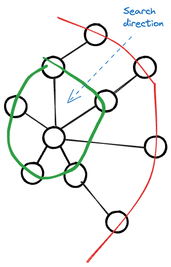

---
tags:
    - Depth-First Search
    - Breadth-First Search
    - Graph
    - Topological Sort
---

# 310 Minimum Height Trees


## Approach 1 BFS

This solution is illustrated in the following diagram:



We start from all leaves nodes, and spirally converge to the center of the tree. At the end, the last two nodes are the root of the tree that give the minimum height.

!!! note
    The stop condition is when the number of nodes is less than or equal to 2. You can think of it as finding the median of odd and even length of the array.
    
### Code Implementation

```python
class Solution:
    def findMinHeightTrees(self, n: int, edges: List[List[int]]) -> List[int]:
        """
        BFS Solution:
        n = 4, edges = [[1,0],[1,2],[1,3]]
        1. build adjacency list
        {
            0:[1],
            1:[0,2,3],
            2:[1],
            3:[1],
        }
        2. count edge
        {
            0:1,
            1:3,
            2:1,
            3:1,
        }
        3. maintain a queue that stores leaf node (where edge == 1)
        4. iterating until the queue's length is less than 2,
        conducting BFS, we poping the leaf node, reduce the associated
        nodes (by adj list), then reduce the edge count by 1.
        Note:
        - One edge case is that: when n = 1, there is no edges. Since node starting from n-1,
        so we return [0].
        """
        if n == 1:
            return [0]

        adj_list = defaultdict(list)
        for a,b in edges:
            adj_list[a].append(b)
            adj_list[b].append(a)
        
        edge_count = {}
        leaves = collections.deque()
        for node,neighbors in adj_list.items():
            edge_count[node] = len(neighbors)
            if len(neighbors) == 1:
                leaves.append(node)
        
        while leaves:
            # base case
            if n <= 2:
                return list(leaves)
            for i in range(len(leaves)):
                node = leaves.popleft()
                n -= 1
                for neighbor in adj_list[node]:
                    edge_count[neighbor] -= 1
                    if edge_count[neighbor] == 1:
                        leaves.append(neighbor)
```

