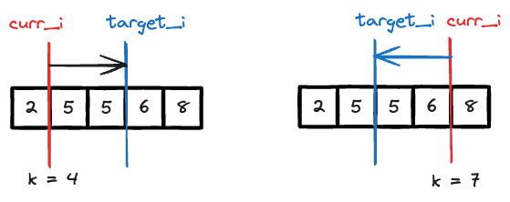

# [3107 Minimum Operations to Make Median of Array Equal to K](https://leetcode.com/problems/minimum-operations-to-make-median-of-array-equal-to-k/description/)


My intuition is that, it's a prefix sum problem since it has keyword `make median of array equal to K`, but it's not asking for anything related to subarray. So i didn't go that direction.

In the dry run, to determine the number of operations, on the paper, I will sort it first,since it's easier to look at it that way. Then find the median, then calculate the number of operations. So it occurs to me that whether i could afford to sort it. Look at the constrains

- n <= $10^5$
- 1 <= nums[i] <= $10^9$
- k <= $10^9$

So, after sort, $O(nlogn)$ would be like on the worst possible case that we can AC it. So i went down that route.


## Approach 1

- sort the `nums`
- find the `curr_i` defined as the index where `k` should be inserted in sorted `nums`
- find the `target_i` defined as the index that the median should be



```python
class Solution:
    def minOperationsToMakeMedianK(self, nums: List[int], k: int) -> int:
        nums.sort()
        n = len(nums)
        
        # find location of k in sorted(nums)
        if k < nums[0]:
            curr_i = 0
        elif k >= nums[-1]:
            curr_i = n
        else:            
            for i in range(1,n):
                prev = nums[i-1]
                curr = nums[i]
                if k < curr and k >= prev:
                    curr_i = i
                    break
        
        # find where the index should be
        if curr_i >= n//2 + 1:
            target_i = n//2
        else:
            target_i = n//2 +1
        
        res = [abs(num - k) for num in nums[min(curr_i,target_i):max(curr_i,target_i)]]
        return sum(res)
```