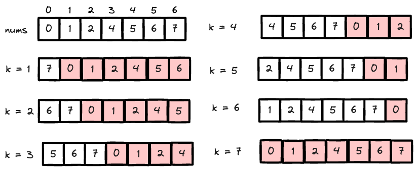

---
tags:
    - Array
    - Binary Search
---
# [33 Search in Rotated Sorted Array](https://leetcode.com/problems/search-in-rotated-sorted-array/)

这题可以分为两步， 

- 找到最小值的位置，也就是在哪pivot
- wrap around

关于找到最小值的位置，详情见[153 Find Minimum in Rotated Sorted Array](../153-find-minimum-in-rotated-sorted-array/index.md)

同时rotated sorted array有一个sorted性质，当且仅当

- num in `nums` are distinct
- `nums` is sorted



From the diagram above, we have notice that as k goes from 1 to n-1, more and more elements from the **start of the array** will be moved to the **end of the array**. After realizing the pattern, we realize we could use 

$$
\begin{equation}
\left(x_{original} + k\right)\bmod n = x_{rotated}
\end{equation}
$$
where $x_{original}$ is the index of the original array, $k$ is the number of elements moved to the end of the array (or pivot index), and $n$ is the length of the array, $x_{rotated}$ is the index of the rotated array.


```python
class Solution:
    def search(self, nums: List[int], target: int) -> int:
        # for example [0,1,2,4,5,6,7]
        # if k == 0, nothing happens
        # ...
        # if k == n-2 == 5,  --> [1,2,4,5,6,7,0]
        # if k == n-1 == 6, it goes back
        # 1 <= k < n

        # 1. find the starting location of the array with binary search
        # 2. treat it like binar search but you need to wrap the index woth %
        
        # step 1: find min
        n = len(nums)
        left,right = 0,n-1

        # nums[left] > nums[mid] < nums[right]
        while left < right:
            mid = (left + right)//2
            if nums[mid] < nums[right]:
                right = mid
            else:
                left = mid + 1
        
        pivot = left

        left,right = 0,n-1
        while left <= right:
            mid = (left + right)//2
            if nums[(mid + pivot) % n] == target:
                return (mid + pivot) % n
            elif nums[(mid + pivot) % n] > target:
                right = mid - 1
            else:
                left = mid + 1                
        return -1
```