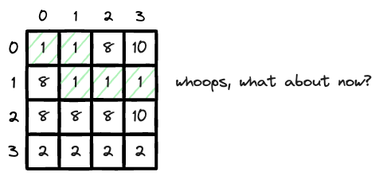

---
tags:
    - Matrix
    - Heap (Priority Queue)
    - Shortest Path
    - Graph
    - Array
---

# [3341 Find Minimum Time to Reach Last Room I](https://leetcode.com/problems/find-minimum-time-to-reach-last-room-i/description/)

一个二维数组，`moveTime[i][j]`为进入这个房间的minimum time, 而且移动一格额外花一秒钟，你spawn在(0,0), 求从`(0,0)` move to `(n-1,m-1)`

一个二维数组中，左上到右下的最短距离，并不一定会是最少的cost, 所以这一题的核心问题是如何寻找到cost最短的路, 

!!! note "Electron Path of Least Resistance"
    Just like electron is always going in the path of least resistance, so does our BFS. How do we always make sure we are exploring the path of least resistance? We use min heap.

    Min heap will alow us to always explore the path of least resistance first before we get stuck in some case like the diagram below,
    
我们用一个min heap记录, 在每一层操作,

- 对于当前最低的cost,at (0,0), 我探索周围四格，依次放入heap
- 对于当前最低的cost in the heap, 我探索周围四格，依次放入heap
- ...

But after a while you realize that you are doing lots of redundant work. 因为你可能多次从不同路径进入同一个cell, 比如

- (0,0) --> (0,1)
- (0,0) --> (1,0) --> (0,0) --> (0,1)

这样在m,n很大时，会无限膨胀你的heap, 你也不想走冤枉路。所以你需要**一个方法记住你到达一个格子目前的最低时间**, 作为判定你是否放入heap的条件，也就是

- 我在(0,0), 走向(0,1), 是否是我第一次走去(0,1)
    - 是第一次, 进入并记录当前cost
    - 不是第一次, 比较进入(0,1)的最低cost,
      - 如果curr_cost < historical min cost to enter，then we put into heap
      - 如果curr_cost >= .., then we ignore this

而这个记住你到达一个格子目前的最低时间的方法，是一个2d array, acting like a big brother guarding his sister against bad boys

以下图做个例子,



- 对于当前最低的cost,at (0,0), 我探索周围四格，依次放入heap
    - 往左走，出界
    - 往上走，出界，
    - 往右走，没来过(1,0), 
    - 往下走，没来过(0,1)
- min heap目前[(2,1,0),(9,0,1)], 对于当前最低时间的格子进行探索, 也就是time = 2, 在`(1,0)`
- ...


## Approach 1

```python
from heapq import heappush,heappop
class Solution:
    def minTimeToReach(self, moveTime: List[List[int]]) -> int:
        # min heap (time,i,j)
        h = [(0,0,0)]
        ROWS,COLS = len(moveTime),len(moveTime[0])
        dp = [[float('inf') for _ in range(COLS)] for _ in range(ROWS)]

        while h:
            t,x,y = heappop(h)
            # termination condition
            if x == ROWS-1 and y == COLS-1:
                return t
            # BFS 4 directions
            for dx,dy in [[-1,0],[0,1],[1,0],[0,-1]]:
                new_x,new_y = x+dx,y+dy

                if new_x >= ROWS or new_y >=COLS or new_x < 0 or new_y < 0:
                    continue                
                # if reach here, it's within boundary
                # calculate new time
                if t >= moveTime[new_x][new_y]:
                    # we can pass
                    new_t = t + 1
                else:
                    # barrier to pass
                    new_t = moveTime[new_x][new_y] + 1

                if new_t < dp[new_x][new_y]:
                    heappush(h,(new_t,new_x,new_y))
                    dp[new_x][new_y] = new_t
        return -1
```
