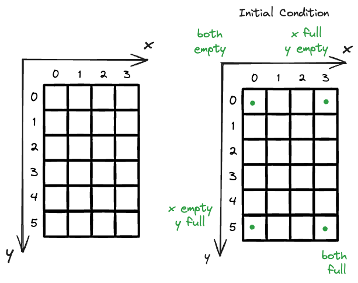
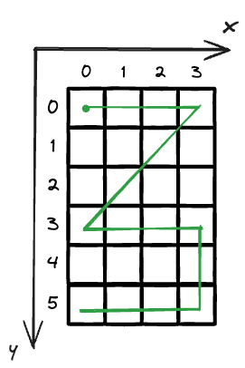

# [365 Water and Jug Problem](https://leetcode.com/problems/water-and-jug-problem/description/?envType=company&envId=lyft&favoriteSlug=lyft-all)


## Intuition

You are given two water jugs with capacity `x` and `y` and you have been asked to reach `target` with the only three operations:

- Fill either jug completely with water.
- Completely empty either jug.
- Pour water from one jug into another until the receiving jug is full, or the transferring jug is empty.

We can convert those operations into more detailed actions and they are

1. fill x until full
2. fill y until full
3. empty x
4. empty y
5. if x is not full, pour y into x until y is empty (source)or x is full (sink)
6. if y is not full, pour x into y until x is empty (source) or y is full (source)

Two jug with discrete amount of water in it, let's use the x = 3, y = 5, target = 4 as example, since it's all integer, the all possible states for x and y are,

```
# number of states
x = 0,1,2,3
y = 0,1,2,3,4,5
```

In total, we have 4 x 6 states, and we start traversing and we could have 



Then we could traverse inside the grid, let's assume we do the following operations and the result will be

- (0,0) initial condition 
- (3,0) fill x
- (0,3) pour x into y
- (3,3) fill x
- (3,5) fill y
- (0,5) empty x



You can see our cursor is moving around inside the grid and each step you can potentially do 6 movements based on boundary condition.

## Approach 1 BFS (1 state)

You realize that out of 6 operations, only 4 of them will change the water volume inside two jug, 

|operation|is_water_volume_changed|
|-|-|
|fill x until full|y|
|fill y until full|y|
|empty x|y|
|empty y|y|
|if x is not full, pour y into x until y is empty (source)or x is full (sink)|n|
|if y is not full, pour x into y until x is empty (source) or y is full (source)|n|

Therefore, we can compress the states from 2D (x,y )to 1D (`total`) and `total` is defined as total amount of water in two jugs. Then we are only working with 4 operations and it's shown in the array below

```
directions = [x,-x,y,-y]
```
to detonate the water volume change in the new state variable `total`. 


!!! note "How to handle out-of-bound" beautifully
    We just need to discuss two out-of-bound check handled by,

    ```python
    if x+y >= total >= 0 and total not in seen:
        seen.add(total)
        queue.append(total)
    ```

    If our current water volume is less than either x or y, then when we deal with operations [-x,-y], we will have a total < 0, which is not recorded.

    Similarly, if our current water volume is almost full, then we add [x,y] to cause the total volume > (x+y), which is also not records.

    Records is a queue that 

    - only take possible operations into it
    - also de-duplicate the states

### Code Implementation
```python
from collections import deque
class Solution:
    def canMeasureWater(self, x: int, y: int, target: int) -> bool:
        if target > x+y:
            return False
        # initialize to be both empty
        queue = deque([0])
        directions = [x,-x,y,-y]
        seen = set()

        while queue:
            curr = queue.popleft()
            for direction in directions:
                total = curr + direction
                if total == target:
                    return True
                if x+y >= total >= 0 and total not in seen:
                    seen.add(total)
                    queue.append(total)
        return False
```

## Approach 2 DFS

## Approach 3 GCD