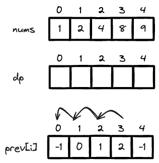

---
tags:
    - Dynamic Programming
    - Array
    - Math
    - Sorting
---
# [368 Largest Divisible Subset](https://leetcode.com/problems/largest-divisible-subset/description/?envType=daily-question&envId=2024-02-09)

压缩DP的题型, 且state transition function依赖于多个前驱节点，且prior nodes需要通过题目条件，也就是`nums[i] % nums[j] == 0` or `nums[j] % nums[i] ==0` 来进行筛选.

## Approach 1 DP bottom-up, $O(N^2)$ time, $O(N)$ space

最重要的思路是，转换, `nums[i] % nums[j] == 0` or `nums[j] % nums[i] ==0` 可以等价于`nums[i] % nums[j] == 0 and i > j`, 这一题目正好满足这个条件, 因为每个数字都是unique的
```
1 <= nums.length <= 1000
1 <= nums[i] <= 2 * 109
All the integers in nums are unique.
```

!!! tip tip
    如果nums中的数字不是unique的，可以构建个hashmap记录每个数字出现的occurrence, 最后max(dp)加上就可以了.

### dp definition
```
dp[i]: 
      the length of the largest divisible subset ending at i elment 
      in the ascendingly sorted input array.
prev[i]:
        the previous index of the largest divisible subset ending at i element.  这个array的value指向的是上一个index that is divisible by nums[i]
```

注意，这并不是我们要求的，我们要求的是任一符合条件的largest divisible subset, 但是这个dp数组可以帮助我们找到最大的index, 然后我们可以通过prev数组回溯找到最大的subset.




### initial condition

```
dp[i] = 1 for all
```

### state transition function

```
if nums[i] % nums[j] == 0:
    dp[i] = max(dp[i], 1 + dp[j])
    if dp[j]+1 == dp[i]:
        prev[i] = j
```
发现了divisible elements就做两件事:

- 更新dp[i]
- `prev[i]`的更新记录了`nums[i]`的previous index, 这个数的previous index为`nums[j]`


代码如下:

```python
class Solution:
    def largestDivisibleSubset(self, nums: List[int]) -> List[int]:
        # largest subset, every num % 1 == 0        
        # dp[i]: 
        #       the length of the largest divisible subset ending at i elment 
        #       in the ascendingly sorted input array.
        # initial conditon:
        #       dp[i] = 1 for all, dp[0] = 0
        # state transition function
        #       dp[i] = max(dp[i], 1 + dp[j])
        #       prev[i] = j, 这个数的previous index为

        nums.sort()
        dp = [1 for _ in range(len(nums))]
        prev = [-1 for _ in range(len(nums))]

        for i in range(len(nums)):
            for j in range(0,i):
                if nums[i] % nums[j] == 0:
                    dp[i] = max(dp[i], 1 + dp[j])
                    # successfully updated
                    if dp[j]+1 == dp[i]:
                        prev[i] = j

        # find the max index    
        max_length = -1
        max_index = -1
        for i,length in enumerate(dp):
            if length > max_length:
                max_length = length
                max_index = i        
        # now we have the max index, 
        # largest divisible subset will be ending at element nums[i] where nums is sorted
        # we need to brack track until we find the res 
        res = []
        
        while max_index != -1:
            res.append(nums[max_index])
            max_index = prev[max_index]
                
        return res
```

## Reference
- [huifeng guan, 残酷刷题群群主](https://www.youtube.com/watch?v=hrwP6I5v1XY&ab_channel=HuifengGuan)