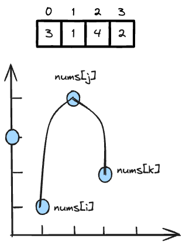

---
tags:
    - Array
    - Binary Search
    - Stack
    - Monotonic Stack
    - Ordered Set
---

# [456 132 Pattern](https://leetcode.com/problems/132-pattern/description/)

这题应用了monotonic stack, 但是相当tricky. 

## Approch 1: Monotonic Stack

需要在数组nums中，发现符合一下条件:
```
i < j < j and nums[i] < nums[k] < nums[j]
```

visualize一下，是找个如下图的山峰,



Therefore, 我们把这个问题分为两个子问题,

- 找到`nums[k] < nums[j]` and `j > k` (等价于next smaller element)
- 找到`nums[i] < nums[k]` and `i < j`


所以我们需要维护

- Traverse `nums[k]`, 一个升序单调栈，让每次进来的`nums[k]`进来找老大.
- 一个`prev_min`数组，记录每个`nums[k]`左边的数组`nums[:k]`的最小值 (not including `nums[k]`)

这样只要每次我们进来的`nums[k]`找到了老大`nums[j]`，我们就可以比较`nums[:j]`中的最小值，是否小于`nums[k]`.


### Code Implementation

```python
class Solution:
    def find132pattern(self, nums: List[int]) -> bool:
        # maintaining a monotonically stack that we have a value that's smaller than it
        """
                x
                        x
        x
        next greater element: maintain 升序单调stack
        next smaller element: maintain 降序单调stack
        
        我们这一题维护的是, 
            1. nums[k], 也就是第三个数. 对于nums[k]是否存在一个打不过的老大也就是stack中还有新来的nums[k]打不过的数. 这个老大也就是nums[j]
            2. 找到老大之后，我们看这个老大的左边，有没有比它弱的数字nums[i].
        """

        # preprocessing a hash for lookup: 
        prev_min = [None for _ in range(len(nums))]
        prev_min[0] = max(nums)+1
        for i in range(1,len(nums)):
            prev_min[i] = min(prev_min[i-1],nums[i-1])

        # traverse the list until found
        stack = []
        for k in range(len(nums)):
            # try to find boss (nums[j])
            while stack and nums[k] >= nums[stack[-1]]:
                stack.pop()
            
            # we find the boss (nums[j])! let's find the nums[i] that's the weakest
            if stack and nums[k] > prev_min[stack[-1]]:
                return True
                
            # append the stack
            stack.append(k)

        return False
```

## Reference

- [Neetcode 132 pattern](https://www.youtube.com/watch?v=q5ANAl8Z458&ab_channel=NeetCode)
