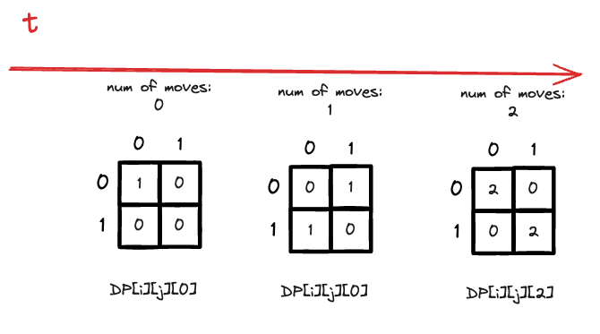
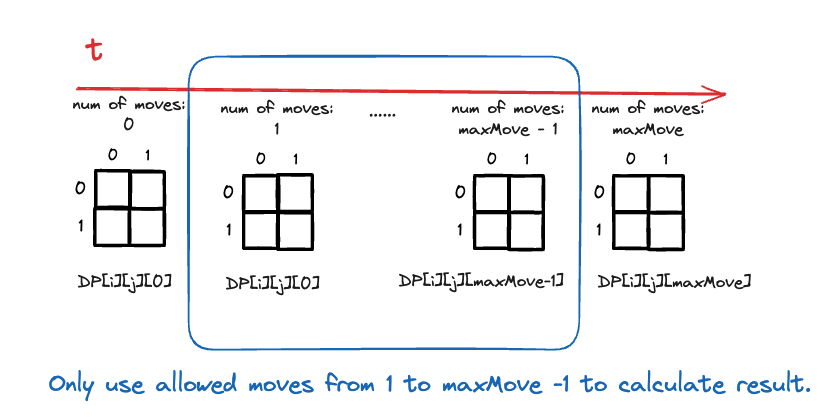

Table of contents:
- [Intuition](#intuition)
- [Approach](#approach)
  - [DP Definition](#dp-definition)
    - [Definition of DP](#definition-of-dp)
    - [Initial Condition](#initial-condition)
    - [State transition function](#state-transition-function)
  - [Points Calculation](#points-calculation)
- [Complexity](#complexity)
- [Code](#code)

# Intuition
<!-- Describe your first thoughts on how to solve this problem. -->
My intuition is that it is a 2D DP problem and use an auxillary 2D array to store information. Since this question is asking for the total number of paths with a constraint on the number of moves, we need to sum up all the solution for (1,2,3,...,maxMove) moves.

We can decompose the problem to, 
- number of ways to go out of boundary with `1` move allowed
- number of ways to go out of boundary with `2` moves allowed
- number of ways to go out of boundary with `3` moves allowed
- ...
- number of ways to go out of boundary with `maxMove` moves allowed

If a football goes out of boundary with 2 moves, then it needs to be at the boundary of the grid with 1 move. Therefore, we can transfer this question into,
- After a total of `0` moves, the ball is at boundary. Calculate the total number of ways to go out of bounda after 1 more move.
- After a total of `1` moves, the ball is at boundary. Calculate the total number of ways to go out of bounda after 1 more move.
...
- After a total of `maxMove - 1` moves, the ball is at boundary. Calculate the total number of ways to go out of bounda after 1 more move.

After decompose the problem into its subproblem and rephrase each sub-problem, we need to
- construct a DP definition that figure out number of ways to reach boundary nodes
- figure out a way to determine what's boundary nodes and interior nodes effecively. 

# Approach
<!-- Describe your approach to solving the problem. -->

## DP Definition

For DP problem, we need to the following three
- definition of DP
- initial condition
- state transition function

### Definition of DP

As stated previously, in order to determine number of ways to reach boundary nodes, we can generalize it to include interior nodes as well (for whole grid). 

> `DP[i][j]` is defined as the number of ways to reach position `(i,j)` with exactly `x` moves, where `x <= maxMove`.


### Initial Condition

Initial condition is `DP[startRow][startColumn] = 1` and rest of the DP array is zero, since we start at this position with 0 moves allowed.


### State transition function

State transition function is defined as, 
$$
\begin{align}
DP[i][j][t] = DP[i-1][j][t-1] \\+ DP[i][j-1][t-1] \\+ DP[i+1][j][t-1] \\+ DP[i][j+1][t-1]
\end{align}
$$
where $t$ the number of moves allowed, `DP[i][j][t]` is the number of ways to reach position `(i,j)` with exactly `t` moves.

We derive this transition function based on, 
- update of DP is completely dependent on the information of the previous step. DP[i][j][t] is completely dependent on DP[i][j][t-1].
- information is updated based on the four directions, up, down, left, right.

Now, if we look at the example provided,  
```
Input: m = 2, n = 2, maxMove = 2, startRow = 0, startColumn = 0
Output: 6
```

We can draw the following diagram, 



The question is asking for the total number of paths to go out of boundary. We can use the information stored in DP[i][j][t] to calculate the number of paths to go out of boundary. For example, if we have `maxMove = 10`, then we can use `DP[i][j][1]` to `DP[i][j][9]` to calculate the total number of paths to go out of boundary. 

> Moving 0 times won't got out of boundary, so we start from 1. We only allow 9 moves, since we have 10 moves in total. So the last move would be "out of bound move".

Since the next time step is only dependent on the previous time step, we only need to use two DP arrays to store the information. One is for the current time step, the other is for the previous time step. 


## Points Calculation

As for relating DP with the number of paths to go out of boundary, we need to think of a way to calculate points.

How to calculate the number of ways to reach out of boundary node. You can think of all nodes consist of inner node, edge node and corner node.
- inner node: 0 ways to reach out of boundary
- edge node: 1 way to reach out of boundary
- corner node: 2 ways to reach out of boundary

However, the inner, edge and corner is only valid for grid size `m > 1` and `n > 1`. As for `m = 1` or `n = 1`, we need to consider the edge cases,


We can use the following mechanism to calculate the "points" by which we can reach out of boundary node.

```python
points = 0
if i+1 >= m: points += 1
if i-1 < 0: points += 1
if j-1 < 0: points += 1
if j+1 >= n: points += 1
```


Finlay, we can calculate the total number of paths to go out of boundary by summing up all the points for each node for allowing move = 1, 2, 3, ..., maxMove -1 as shown in the following diagram.




# Complexity
- Time complexity:
$O(m*n*maxMove)$

- Space complexity:
$O(m*n)$

# Code
```python
from collections import defaultdict
class Solution:
    def findPaths(self, m: int, n: int, maxMove: int, startRow: int, startColumn: int) -> int:        
        # initialization
        DP = defaultdict(lambda: 0)        
        DP_last = defaultdict(lambda: 0)

        DP[(startRow,startColumn)] = 1
        DP_last[(startRow,startColumn)] = 1

        res = 0
        for t in range(maxMove):
            for i in range(m):
                for j in range(n):
                    # max points to get is four when m = 1, n = 1, starting at (0,0)
                    points = 0
                    if i+1 >= m: points += 1
                    if i-1 < 0: points += 1
                    if j-1 < 0: points += 1
                    if j+1 >= n: points += 1
                    res += DP[(i,j)] * points

                    # update DP at t based on t-1
                    DP[(i,j)] = DP_last[(i-1,j)] + DP_last[(i,j-1)] + DP_last[(i+1,j)] + DP_last[(i,j+1)]
                        
            # update DP_last with DP
            DP_last = DP.copy()
            
        return res % (10**9 + 7)
```