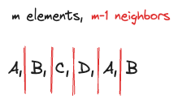

---
tags:
    - Array
    - Hash Table
    - Heap (Priority Queue)
    - Greedy
    - Sorting
    - Counting
---
# [621 Task Scheduler](https://leetcode.com/problems/task-scheduler/description/)

## Approach 1: max heap + hashmap

!!! warning
    max heap + hashmap的效果: 按频率出现的distinct elements. 

What does the optimal solution gonna look like? The strategy will be to minimize the number of neighbors of same tasks. Let's say for `m` tasks, you have `m-1` neighbors.



The reason why this strategy is more optimal is that we have the penalty of `n` idle time for same task. It's a workaround to minimize the likelihood of getting penalized by it.

For examples, `tasks = ['A','B','A','C','D','B',]` will be rearranged into `[A,B,C,D,A,B]` to make As and Bs as far as possible. The pattern is that during one cycle (at most 26 alphabets), we will list the most frequent tasks first, and then the rest of the tasks. In the next cycle, we do the same thing. So in summary,

- In first cycle, we list out the most frequent and distinct tasks first
- In second cycle, we list out the most frequent and distinct tasks first
- ...

How to make sure that we can list `distinct` and `more frequent` values? We can use a hashmap and a max heap to make sure that happens.

- initialize a hashmap as a counter for the tasks
- initialize a `max heap` to store the tasks in descending order of frequency 
```
    (4,'A')
(3,'B') (1,'C') 
```
- maintain `time` for the total time taken to finish the tasks
- while the max heap is not empty, we do the following:
    - initialize a `cycle = n+1` (n is the cooldown time)
    - initialize and maintain a `remaining` list to store the tasks with >= 2 frequencies in heap. It means we gonna need to do them again in next cycle
    - while `cycle` has time left and the max heap is not empty, we do the following:
        - pop the most frequent task from the max heap, and decrement the frequency by 1
        - if that task is still not done, we add it to the remaining tasks
        - we increment the `time` by 1
        - decrement the `cycle` by 1
    - we shovel the remaining tasks back into the `max heap`. If there is nothing left in the heap, we break the loop
    - add the `idle` time into the `time` count. That means `n > len(max_heap)`, 
    

### Code Implementation

```python
from collections import Counter
from heapq import heappush,heappop
class Solution:
    def leastInterval(self, tasks: List[str], n: int) -> int:
        # 1. 最优解会是什么样的？也就是两元素相邻的越少即可。for m个任务，有m-1个相邻点.
        # 2. 有可能有多个最优解;
        # hashmap + max heap: 保证让distinct的最多的出来

        counter = Counter(tasks)

        priority_queue = []
        for task,freq in counter.items():
            heappush(priority_queue,(-freq,task))
        
        time = 0
        while priority_queue:
            # do one cycle
            cycle = n + 1
            remaining = []
            while cycle > 0 and priority_queue:
                max_freq, task = heappop(priority_queue)
                max_freq *= -1
                if max_freq > 1:
                    max_freq -= 1
                    remaining.append((-max_freq,task))
                time += 1
                cycle -= 1
            # 塞回去
            for item in remaining:
                heappush(priority_queue,item)
            # 如果空了,也不需要idle了
            if not priority_queue:
                break

            # add idle time into time count
            time += cycle
        return time
```
