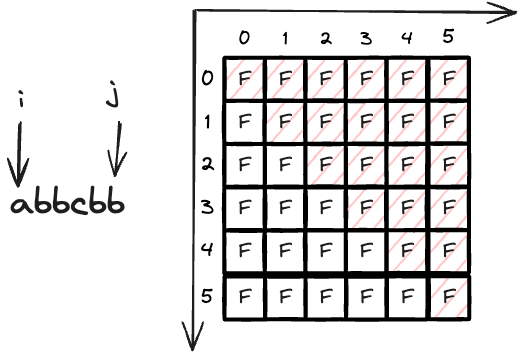

---
tags:
    - String
    - Dynamic Programming
    - Palindrome
---
# [647 Palindromic Substrings](https://leetcode.com/problems/palindromic-substrings/submissions/1171031234/?envType=daily-question&envId=2024-02-10)

这一题的LC premium article写的实在太牛逼了，这篇post的很多表达方式，都借鉴了这篇文章. 

## Palindrome 

回文串的定义是，正着读和倒着读是一样的，比如`"aba"`, `"abba"`, `"abcba"`. 一共有两种palindrome, 一种是奇数长度的，一种是偶数长度的.

奇数的有`"aba"`, 偶数的有`"abba"`, `"aa"`. 

!!! tip Tip
    Palindromes are compositionally homogeneous around their center.

In layman's terms, smaller palindromes make up larger palindromes. 一个大的palindrome一定由小的palindrome组成.比如你有一个palindrome `eve`,

- `eve`往里走，那么`eve`的中心，也就是`v`一定也是个palindrome
- `eve`往外扩展，只需要符合左右增加的character相等，那么就是palindrome, 比如过`level`.

## Approach 1 Brute force $O(N^3)$ time, $O(1)$ space

```python
class Solution:
    def countSubstrings(self, s: str) -> int:
        # Brute force: travsere all potential substring O(N^2), determine palindrome or not, two pointer O(n)        
        
        def is_palindrome(s,left,right):
            while left < right:
                if s[left] != s[right]:
                    return False
                left += 1
                right -= 1
            return True

        res = 0
        for i in range(len(s)):
            for j in range(i,len(s)):
                if is_palindrome(s,i,j):
                    res += 1
    
        return res
```

注意一下python中string slicing也是right exclusive的，所以word = s[i:j+1]，这样的话，word的长度就是j-i+1, 也就不会miss掉最后一个字符. 

```python
class Solution:
    def countSubstrings(self, s: str) -> int:
        # Brute force: travsere all potential substring O(N^2), determine palindrome or not, two pointer O(n)        
        
        def is_palindrome(word):
            left,right = 0,len(word)-1,
            while left < right:
                if word[left] != word[right]:
                    return False
                left += 1
                right -= 1
            return True

        res = 0
        for i in range(len(s)):
            for j in range(i,len(s)):
                word = s[i:j+1]         
                if is_palindrome(word):
                    res += 1
    
        return res
```


## Approach 2 DP $O(N^2)$ time, $O(N^2)$ space

### 如何确定是否用DP?

DP等价于,
- Optimal substructure
- Overlapping subproblems

As for Optimal substructure, since palindrome is made of smaller palindrome. 也就是这个有substructure. 

As for overlapping subproblems, 我以前没怎么理解这一层的意思，in layman's term, 其实就是有重复计算的意思. 我们拿`level`作为例子，如下表所示.

|word|`level`|`eve`|`v`|
|-|-|-|-|
|`level`|1|1|1|
|`eve`|0|1|1|
|`v`|0|0|1|

这里`level`, `eve` and `eve`这三个problem, 都共享了`v`这个subproblem，被解了三次，这也是overlapping subproblems的意思.

### dp definition

这是二维dp的一个典型题目，`dp[i][j]`表示`s[i:j+1]`是否是palindrome, 如下图所示



!!! note note
    你注意到了吗? 这个矩阵，只需要upper triangle就可以了.

### Initial condition

这一题有两个base case, 一个是奇数长度的，一个是偶数长度的, 所以更新由下图所示, 


简化一下的话, for odd case, 其实就是kronecker delta $\delta{ij}$,

$$
\begin{equation}
    dp(i,j) = \begin{cases}
        1 & \text{if } i = j \\
        0 & \text{if } i \neq j
    \end{cases}
\end{equation}
$$

for even case, 

$$
\begin{equation}
    dp(i,i+1) = \begin{cases}
        1 & \text{if } s[i] = s[i+1] \\
        0 & \ otherwise
    \end{cases}
\end{equation}
$$

### State transition function

常规方法为, 左pointer为`i`, 右pointer为`j`. 但我们可以换一个思路，因为我们已经求了length = 1 and 2的情况，所以我们可以直接从length = 3开始，这样的话，我们可以直接用length来遍历，然后用`i`来遍历所有的起始点, 通过`i`和`length`来确定`j`. 

A string is palindrome的充要条件变为:

- its first and last characters are the same
- the rest of the string (excluding the first and last characters) is also a palindrome

可以formulate成如下的state transition function:

$$
\begin{equation}
    dp(i,j) = \begin{cases}
        True & \text{if}\quad dp(i+1,j-1) = True \text{ and } s[i] = s[j] \\
        False & \text{otherwise}
    \end{cases}
\end{equation}
$$

由于我们的计算顺序是:

- base case
  - 先计算长度为1的
  - 再计算长度为2的
- length >= 3

我们求length = 3的时候，我们的dp[][]数组已经有了长度为1 and 2的信息，所以我们可以直接用`dp[i+1][j-1]`来判断是否是palindrome. 需要解决当前长度的substring的问题所需的所有信息，已经被cache了.

```python
class Solution:
    def countSubstrings(self, s: str) -> int:
        res = 0
        n = len(s)
        dp = [[False for _ in range(n)] for _ in range(n)]

        # base case odd
        for i in range(n):
            dp[i][i] = True
            res += 1
        
        # base case even
        for i in range(n-1):
            if s[i] == s[i+1]:
                dp[i][i+1] = True
                res += 1

        for length in range(3,n+1):
            for i in range(0,n + 1 - length):
                j = length + i - 1
                if dp[i+1][j-1] and s[i] == s[j]:
                    dp[i][j] = 1
                    res += 1
            
        return res1
```

## Approach 3 DP, space optimized $O(N^2)$ time, $O(N)$ space


## Approach 4 Expand around center $O(N^2)$ time, $O(1)$ space