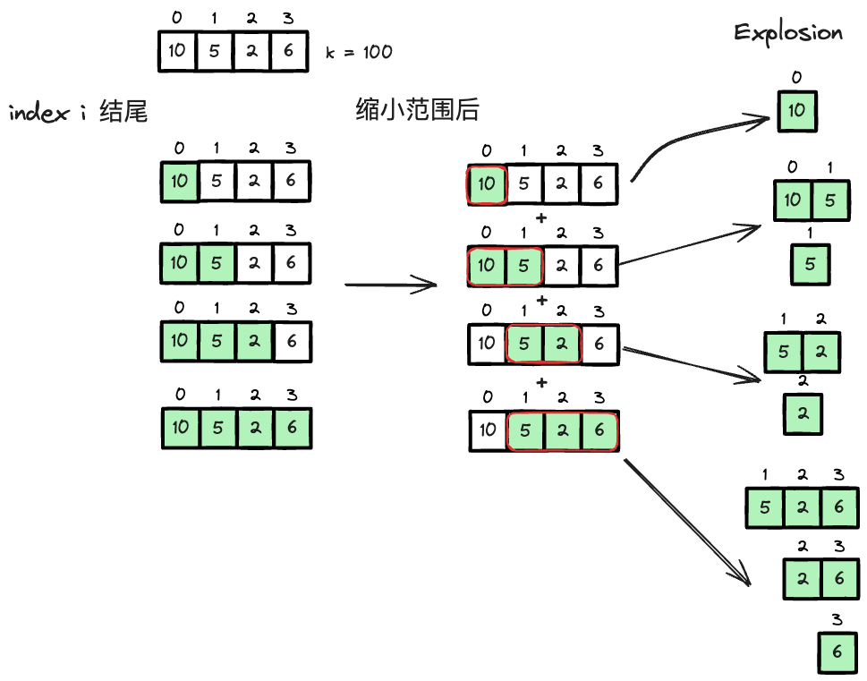

---
tags:
    - Array
    - Sliding Window
---

# 713 Subarray Product Less Than K


这题长得很像prefix的题目，560 subarray sum equals k，但是这题是subarray product less than k, 意味着我们没办法以$O(1)$的时间复杂度来查找哈希表里的值. 

!!! warning
    看editorial之前，我的思路是用prefix-sum的想法解决这个问题，但不work, 原因是我们没办法用$O(1)$的时间复杂度来查找哈希表里的值. 之后我的思路想到了sliding window, 但我的dry run sliding window的指针移动条件是:

    - 如果product < k, right += 1
    - 如果product >= k, 我们先backtrack `right -= 1`,让窗口中的product减少到前一步的`<k`. 然后window不断shrink `left += 1`. 过程中我们维护product以及符合条件的counter的值

    但这么做没办法枚举出所有的subarray.
  

## Approach 1: Sliding Window


这题难点有是,

- 如何come up with sliding window的解法
- 如何拆解"所有的subarray"这个问题.

怎么分解subarray这个问题有点像DP时做过的思路, 我们可以用所有以`i`结尾的subarray, 来表示所有的subarray. 换句话说，所有的subarray能够用:

- 以index `0`结尾的subarray
- 以inde x`1`结尾的subarray
- ...
- 以index `n-1`结尾的subarray

来表示. 我们再进一步缩小范围来搜索所有满足subarray product < k的subarray, 我们可以用sliding window来做. 也就是说，我们把上述问题转化为了,

- 以index `0`结尾的subarray, 且product < k
- 以index `1`结尾的subarray, 且product < k
- ...
- 以index `n-1`结尾的subarray, 且product < k

由于都是正整数，subarray product, 随着我们`left += 1`, 可以找到一个临界array, 使得product < k. 这个临界array就是问题的关键点. 这就涉及到第二个思路，如何通过临界array计算其中符合条件的subarray的个数. 这一思考过程如下图，



我们总结一下，不难发现，以`i`结尾的subarray的个数为`window size`, 即`right - left + 1`. 这个思路是关键，我们可以再做一次转化,

- 以index `0`结尾的满足条件的最大临界subarray的window size
- 以index `1`结尾的满足条件的最大临界subarray的window size
- ...
- 以index `n-1`结尾的满足条件的最大临界subarray的window size

$$
\text{total} = \sum_{i=0}^{n-1} w_i
$$
where $w_i$ the size of the largest window ending at index `i` that with its product < k.


```python
class Solution:
    def numSubarrayProductLessThanK(self, nums: List[int], k: int) -> int:
        """
        BFS: O(n^2) for finding all nums, O(n) for doing the product
        --> minior improvement of it by pre-processing
        
        nums[1] \in [1,1000]
        x x x [x x x]
               i.  j
        x x x [x x x]
            i-1    j
        [x x x] x x x x
         i   j

        we one pass scan with pointer "right", and we calculate every possible array by combining solution for
        every subarray ending at pointer [right]
        """
        # edge case
        if k <= 1:
            return 0
        
        total = 0
        rolling_product = 1
        left = 0
        for right,num in enumerate(nums):
            rolling_product *= num

            while rolling_product >= k:
                rolling_product /= nums[left]
                left += 1
            # if we reach here, it's the minimum size subarray that with its product < k and ending at "right"
            total += right - left + 1
        return total
```

## Approach 2: Binary Search

有一个math intuition for logrithms, it has a property that the sum of logarithms is "approximately equal" to the logarithm of the product.

