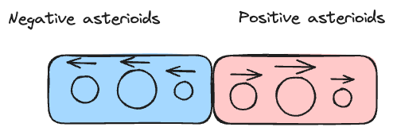

# [735 Asteroid Collision](https://leetcode.com/problems/asteroid-collision/description/)

## Intuition

这一题brute force是$O(N^2)$, 你需要对每一个asteroid进行simulation，和当前asteroid所有右边的asteroids进行判定，是否会因为collision而消失。但input range ~$10^4$决定了最优答案必定是$O(N)$解, 不可能是$O(N^2)$. 这题有点类似的是monotonic stack, 但不一定需要单调性.

这题的solution array,必然符合如下的条件:

- `case1`: 空集 []
- `case2`: 全是往左走的asteroids [-100,-20,-1]
- `case3`: 全是往右走的asteroid [2,3,4,]
- `case4`: 两边都有的走的asteroid [-100,-20,-1,2,3,4,]

对于第三种case, 一定不会存在正负穿插的情况，且negative asteroid必然在positive asteroid左边, 不然会相撞然后相消。

!!! note
    你可以用反证法枚举几个

    - [2,-10] reduces to [-10]
    - [2,3,-1] reduces to [2,3]
    - [2,1,-2] reduces to []

根据此，我们可以得到solution array规律



Then we just need to think how to achieve this goal. Let's assume we need two auxillary data structure to store negative asteroids and positive asteroids, respectively

- `negative asteroids`: 一个auxillary数据结构，存储所有打遍天下无敌的negative asteroid. 无敌的定义是for a negative asteroid `asteroids[i]`, 左边没有比它能打的positive asteroid, 用array即可.
- `positive asteroids`: 暂时存储还没有被打败的asteroid.


## Approach 1 Stack

- `Time Complexity`: $O(N)$, 每个asteroid最多1进1出, $O(2N)$ reduces to $O(N)$
- `Space Complexity`: $O(N)$


```python
class Solution:
    def asteroidCollision(self, asteroids: List[int]) -> List[int]:
        """
        Key:
            - Two asteroids moving in the same direction will never meet.
        
        All elements in the solution array must follow the pattern below:
            [-100,-99, .... , 10,20,101]
        反证法，如果我们存在
            [101,-99] 一定会有一个碎, --> [101]
        
        Goal:
            - 每一个negative asteriod的使命是打碎在它左边的所有比他小的postive asteriod
            - kinda like monotonic stack
        """
        
        stack = [] # where positive asteriods lives, temporarily
        res = [] # where negative asteriod lives

        for a in asteroids:
            if a > 0:
                stack.append(a)
            else:
                while stack and stack[-1] < abs(a):
                    stack.pop()

                # Victory: 这个negative asteriod已经杀完了所有的positive asteriods
                if not stack:
                    res.append(a)
                # Tie: 这个negative asteriod没办法杀完所有的positive asteriod, 碰到了一样强的positive asteriod. 这俩asteriod同归于尽
                elif stack[-1] == abs(a):
                    stack.pop()
                else:
                    # Loss: 这个negative asteriod没办法杀完所有的positive asteriod, 碰到了比他更强的positive asteriod, 死了(不保存)
                    pass
        res += stack
        return res                    
```