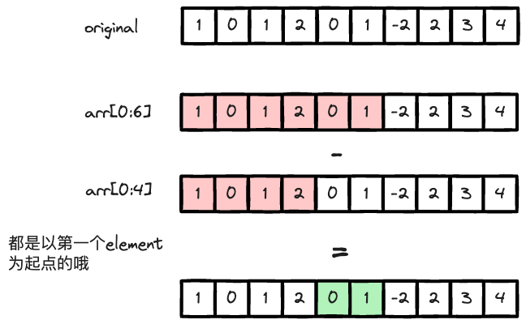
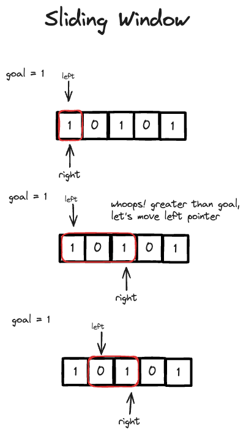
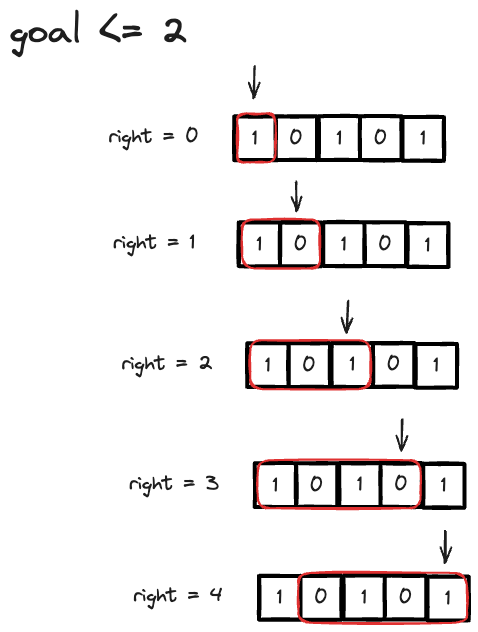

---
tags:
    - Array
    - Hash Table
    - Sliding Window
    - Prefix Sum
---

# [930 Binary Subarrays With Sum](https://leetcode.com/problems/binary-subarrays-with-sum/description/?envType=daily-question&envId=2024-03-14)

第一直觉是sliding window, 但没想出来. 

## Approach 0 Brute Force

By enumeration to exhaust all the subarrays, it's $O(n^2)$ time complexity. Hit TLE. 

!!! info
    其实看constraints也能排除. 因为n的范围是[1, 3*10^4]，所以O(n^2)的解法肯定会TLE, 估摸着最多能到O(nlogn)的解法.

```python
class Solution:
    def numSubarraysWithSum(self, nums: List[int], goal: int) -> int:
        n = len(nums)
        count = 0
        # nums[j:i+1]
        for i in range(n):
            prefix_sum = 0
            for j in range(i,n):
                prefix_sum += nums[j]
                if prefix_sum == goal:
                    count += 1
        return count
```

### Code Implementation

```python
class Solution:
    def numSubarraysWithSum(self, nums: List[int], goal: int) -> int:
        n = len(nums)
        count = 0
        # nums[j:i+1]
        for i in range(n):
            prefix_sum = 0
            for j in range(i,n):
                prefix_sum += nums[j]
                if prefix_sum == goal:
                    count += 1
        return count
```

## Approach 1 Prefix Sum + Hash Table

Hashtable记录prefix sum的次数. 我们需要traverse the array, 求total_sum. 在每一个iteration, 我们都做两件事

- 从0开始的subarray的和 == `target` (也就是the sum we are iterating through)
- 在过去的prefix_sum中，找到满足current prefix_sum - previous prefix_sum == target的次数

!!! info "Prefix Sum解决的问题"
    针对连续n个数的和等于target的问题, 可以使用prefix sum + hash的方法来解. hash key是prefix sum的值, value是出现的次数. 用hash的原因是为了储存previous prefix sum的次数. **所有的subarray的和，都可以由两个subarray的prefix sum相减得到.** 你可以思考一下，是不是所有的subarray都可以由两个以0为起点的subarray相减得到？

思考一下info panel里的问题，顺便看看下图,



### Code Implementation

```python
from collections import defaultdict
class Solution:
    def numSubarraysWithSum(self, nums: List[int], goal: int) -> int:
        # Problem: contiguous k number summing up to goal
        # BF: running all the subarray from length of 1, 2,..., 5
        # O(n^2) for traversing O(n) for summing, O(n^3) total, TLE for size of 3*10^4
        # looking at something O(nlogn) worst
        
        total_count = 0
        prefix_sum = 0
        freq = defaultdict(int)

        for num in nums:
            prefix_sum += num
            if prefix_sum == goal:
                total_count += 1
            
            # check if there is any existing prefix sum that can be subtracted from the curr prefix sum
            # to get the desired goal
            if prefix_sum - goal in freq:
                total_count += freq[prefix_sum - goal]

            # update map
            freq[prefix_sum] += 1
        
        return total_count
```

## Approach 2 Sliding Window

Sliding Window的逻辑，我们维护一个window with left and right pointer. 由于这个数组里面的数都是0和1，不存在负数，也就是说，

- when moving right pointer, subarray sum是递增的(不变 or increase).
- when moving left pointer, subarray sum是递减的(不变 or decrease).

我们只需要move right pointer till the subarray sum > goal, 然后move left pointer till the subarray sum < goal. 这样的话，我们就可以得到所有的subarray sum 为 goal的subarray. 具体如下图,



但这里有一个edge case, 当goal = 0时候，当我们right pointer encounter 1的时候，我们开始move left pointer, 结果发现不管怎么移动，subarray sum都是1, 如下图.


这里要用到一个trick, 比如计算所有为goal = 2的subarray，我们计算所有<=3的subarray，然后减去所有<=1的subarray，就得到了所有为goal = 2的subarray. Two pass solution. 在right pointer traverse的时候，我们计算符合条件的最大window size, 这个window size等价于ending at right pointer的subarray的个数. 你可以自己数数下面这图, 



!!! warning "思考"
    所有以right pointer为结尾,且符合`prefix_sum <= goal`的subarray的个数，正好等于符合条件的最大window size. 有两个条件:
    
    - 以right pointer为windows结尾
    - 最大符合条件的window size. 由于我们有个`while curr_sum > x`, 当curr_sum == x的时候跳出循环, 我们就正好得到了最大window size.
  
    这个思想在DP里面经常用到，以i为结尾啊，以i为开头啊.

### Code Implementation

```python
class Solution:
    def numSubarraysWithSum(self, nums: List[int], goal: int) -> int:
        def helper(x):
            """
            return number of subarray with sum <= x
            """
            # edge case
            if x < 0:
                return 0

            l = 0
            curr_sum = 0
            res = 0
            for r in range(len(nums)):
                curr_sum += nums[r]
                while curr_sum > x:
                    curr_sum -= nums[l]
                    l += 1                
                # size of the window
                res += (r - l + 1)
            
            return res

        return helper(goal) - helper(goal-1)
```

## Reference

- [Neetcode LC 930](https://www.youtube.com/watch?v=j4JDr4-jvo4&ab_channel=NeetCodeIO)