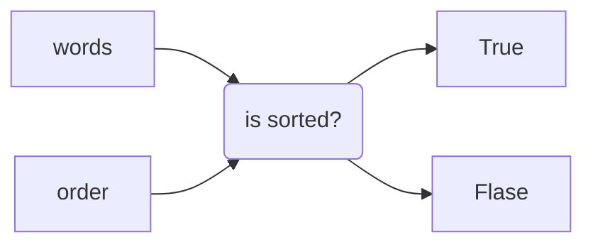

# Problem
这一题题目如下, 输入是:
- `words`: list, containing strings only such as `words = ["hello","leetcode"]`
- `order`: string, 由乱序的24个英文字母组成，代表着外星语言的"abc...z"的顺序,例如`order = "hlabcdefgijkmnopqrstuvwxyz"`

判断这个list中的string,是否是sorted lexicographically? return boolean result.



# 错误思路
我一开始的思路是:
- 建立一个hash, 给这24个character in order, 赋予不同的numerical value
- 累加每个string的总分值$\sum c_i$ for `string = 'hello'`
- 比较最后总分值

这个思路有两个弊端:
- 需要对每一个string进行估分后，再比较, 比如比较`hello`和`leetcode`俩string, 只需要比较第一个character就能知道大小了,求分数总和就很浪费了;
- 你很难设计正确的分值，假设a-z的分值为1-24, 那么`acd` 为 1+3+4 = 8, `abe` 为 1+2+5 = 8; 所以这种累加的方式也不适合;
  - 我一开始的思路还有设置一个10位，100位，千位，也就是越前面的数字，占的比重就越大，实际上就是为了剥离上条所说的情况，每一位数，至少比前一位大24,才能保证上一位比这一位大; 最后24n, n为string的长度，也就是说，string过长的test case会有overflow的情况；

# Approach 1: Compare adjacent string
<!-- Describe your approach to solving the problem. -->
思路就是:
- 将order转化为hash,赋予不同的值
- traverse through words, 两两比较大小, 利用transitive property of equality i.e. a < b, b < c then a < b < c, then [a,b,c] is sorted
- traverse相邻俩string, sequentially比较逐个的大小;


## Complexity
- Time complexity: $O(nm)$ where n is the size of the words list, m is the average length of string in the list;
<!-- Add your time complexity here, e.g. $$O(n)$$ -->

- Space complexity: $O(1)$
<!-- Add your space complexity here, e.g. $$O(n)$$ -->

## Code
```python
class Solution:
    def isAlienSorted(self, words: List[str], order: str) -> bool:

        # hashmap for orders
        hashtable = {}

        # assgin value for each character
        for i,char in enumerate(order):
            # 
            hashtable[char] = i

        # 外循环. iter list O(n)
        for i in range(len(words)-1):
            # 比较相邻俩string的长度
            min_length = min(len(words[i]),len(words[i+1]))

            # 内循环 iter 俩相邻string中较短的那一个的长度
            for j in range(min_length):
    
                if words[i][j] == words[i+1][j]:
                    # 如果两个字符相等, jump to next iteration,比较下两个character
                    continue    
                else:
                    # 如果两个字符不等，比较大小
                    if hashtable[words[i+1][j]] > hashtable[words[i][j]]:
                        # 目前 sorted, break 内循环 
                        break
                    else:
                        # 不sorted, return false
                        return False
            
            # 如果能循环到这里，就是["apple","app"] 这种情况了
            if len(words[i]) > len(words[i+1]) and hashtable[words[i+1][min_length-1]] == hashtable[words[i][min_length-1]]:
                return False

        # 比较下来，每一个都是sorted
        return True
```


## 优化code
再几个地方可以优化:
- boudnaries: 由于俩相邻的string, length不确定，不知道用哪个作为循环条件，我采用的方法是找到相邻string的min length, 然后循环min length次数,但实际上不用;
- naming: 以后hashtable这样的命名方式, 可以根据具体用意改`for index,val in enumerate(order): order_map[val] = index` 这样比较清晰;


```python
class Solution:
    def isAlienSorted(self, words: List[str], order: str) -> bool:
        
        order_map = {}
        for index,char in enumerate(order):
            order_map[char] = index

        # iterate through the list
        for i in range(len(words)-1):
            # iterate throught the 1st string in the string pair
            for j in range(len(words[i])):
                

                # 如果坚持到这,还没分出大小, 比较string长度
                # ["apple","app"]
                if j >= len(words[i+1]):
                    return False
                
                # 找到俩相邻string的第一个不同的character
                if words[i][j] != words[i+1][j]:
                    # 比较char in string one 是否大于char in string two
                    if order_map[words[i][j]] > order_map[words[i+1][j]]:
                        return False
                    
                    # not sorted, 比较下两个string去
                    break
                """
                三种方式跳出内循环:
                1. 比较current index j with 下一个string的长度，cover corner cases ["apple","app"]
                if j >= len(words[i+1])
                2. 第一个不相同的char, 满足sorted, then break
                3. 第一个不相同的char,不满足sorted, return False
                那么不跳出内循环的可能性，就是:
                ["app","apple"] 满足app < apple, sorted;
                """
                

        return True
```