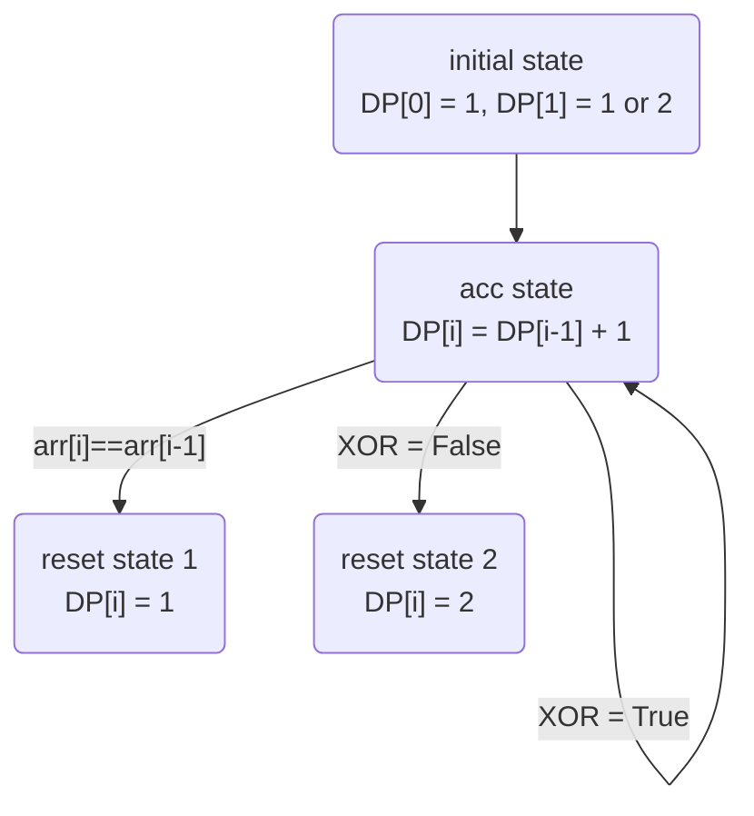

# Approach 1: Bottom up, Linear Space
<!-- Describe your approach to solving the problem. -->

My intuition when i see turbuelnce subarry is that 
```
> < > < > < > <
```
For a simple array [a, b, c] to be a turbulent array, we could have
```
Situation1: a > b < c
Situation2: a < b > c
``` 
The signs are fliping with every single time and it exisits a concise way to represent the state. If a, b ,c are distinct numbers (no duplicate) then the array `[a,b,c]` is turbulent is equivalent to the following statement
```
(a > b) XOR (b > c)
```

Then, Similar to bottom-up solution for maximum subarray, we just need to define a `DP[i]` function that means the maximum turbulent subarray ending on `array[i]` (must include element `array[i]`). Then we do one pass solution while calculating `DP[i]` based on the state info stored in XOR.

## Algorithm
- construct `DP[i]`
- initialize `DP[0]` and `DP[1]`
- iterate throught the `array[2:]`
    - case when `array[i]` = `array[i-1]`, it means the maximun turbulent subarray ending on `array[i]` is 1. Example:  array = [2,1,3,3], DP[3] = 1.
    - case when XOR returns `True`, it means we increment by one
    - else, it means XOR returns `False`, it means we reset to 2.
- return maximum in the `DP` array

## State transition diagram


## Complexity
- Time complexity: $O(n)$
<!-- Add your time complexity here, e.g. $$O(n)$$ -->

- Space complexity: $O(n)$ to store previous maximum turbulent subarray length 
<!-- Add your space complexity here, e.g. $$O(n)$$ -->

## Code
```python
class Solution:
    def maxTurbulenceSize(self, arr: List[int]) -> int:
        # DP[i]: length of maximum turbulent subarray ending on arr[i]
        # bottomUp constant space Solution

        if len(arr) == 1: return 1
        # initialize DP, at first two elements
        DP = [None for _ in range(len(arr))]
        DP[0] = 1        
        if arr[0] == arr[1]:
            DP[1] = 1
        else:
            DP[1] = 2

        # bollean flag
        flag = arr[1] > arr[0]

        for i in range(2,len(arr)):
            # edge case when equal, we reset to 1
            if arr[i] == arr[i-1]:
                DP[i] = 1
                continue

            if flag ^ (arr[i] > arr[i-1]):
                # successfully update
                DP[i] = DP[i-1] + 1

                # update flag
                flag = arr[i] > arr[i-1]
            else:
                # update fails, rest to maximum turbulent subarray length ending on arr[i], which is 2.
                DP[i] = 2

        return max(DP)
```

# Approach 2: Bottom up, Constant space

We don't need to store the whole array and just need to track and update the maximum length of turbulent subarray for return. We do the following:

```python
class Solution:
    def maxTurbulenceSize(self, arr: List[int]) -> int:
        # bottom up, constant space
        # current_length: current maximum turbulent ending on

        if len(arr) == 1: return 1

        # initialize DP, at first two elements
        if arr[1] == arr[0]:
            current_length = 1
        else:
            current_length = 2

        maximum_length = current_length

        # bollean flag
        flag = arr[1] > arr[0]

        for i in range(2,len(arr)):
            # edge case when equal, we reset to 1
            if arr[i] == arr[i-1]:
                current_length = 1
                maximum_length = max(maximum_length,current_length)
                continue

            if flag ^ (arr[i] > arr[i-1]):
                # turbulent, so increment current length
                current_length += 1
                # update flag
                flag = arr[i] > arr[i-1]
            else:
                # rest current_length to 2, which only has two elements [0,1,2] --> [1,2] 
                current_length = 2
            
            maximum_length = max(maximum_length,current_length)

        return maximum_length
```

# Summary

The problem is very similar to maximum subarry and this solution provides:
- a solution framework similar to the editoral of the maximum subarray 
- the trick using `XOR` to represent state.
