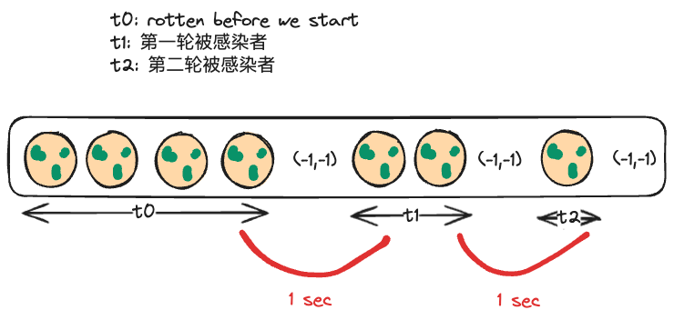

# [994 Rotting Oranges](https://leetcode.com/problems/rotting-oranges/description/?envType=company&envId=lyft&favoriteSlug=lyft-thirty-days)

## Intuition

Classic BFS to simulate how rotten oranges propagates layer by layer until all fresh oranges are gone. The trick is we have to put a `marker node (-1,-1)` to separate different layers of rotten oranges,



!!! note
    The number of `marker node (-1,-1)` is greater than actual time elapsed by one. That's why we have 

## Approach 1 BFS

```python
from collections import deque
class Solution:
    def orangesRotting(self, grid: List[List[int]]) -> int:
        """
        every rotten organce will radiate out a circle that grows every minute. 
        Objective:
        - To find the minumum number of minutes that must elapse until no cell has a fresh orance    

        Some edge case is "isolated "
        反例:
        [2 0 0
         0 0 1
         1 1 1]
         2 will never impacts other cuz it's isolated

         [2 1 1
          0 1 1
          1 0 1]
        """
        queue = deque([])

        fresh_oranges = 0
        time_elapsed = 0
        ROWS,COLS = len(grid),len(grid[0])
        
        for r in range(ROWS):
            for c in range(COLS):
                if grid[r][c] == 1:
                    fresh_oranges += 1
                elif grid[r][c] == 2:
                    queue.append((r,c))
        
        # append a marker node for end of 1 round of rotten oranges
        queue.append((-1,-1))
        
        directions = [(-1,0),(1,0),(0,1),(0,-1)]
        
        while queue:
            i,j = queue.popleft()
            # check if we encouter a marker
            if i == -1:
                time_elapsed += 1
                if queue:
                    queue.append((-1,-1))
            else:
                # processing rotten oranges
                for direction in directions:
                    delta_i,delta_j = direction
                    next_i,next_j = i+delta_i,j+delta_j
                    # check if the it's within range
                    if ROWS > next_i >= 0 and COLS > next_j >= 0:
                        # if fresh, we do something
                        if grid[next_i][next_j] == 1:
                            grid[next_i][next_j] = 2
                            queue.append((next_i,next_j))
                            fresh_oranges -= 1
            
        return time_elapsed-1 if fresh_oranges == 0 else -1
```