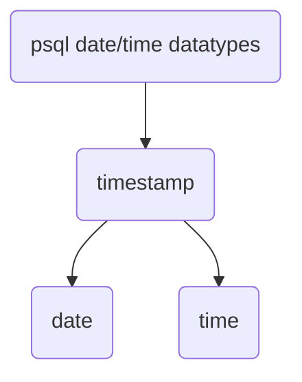

# Dating

In this session, we will use `MySQL` as an example,

## MySQL


### Date Arithmetic

|-|description|example|
|-|-|-|
|`DATE_ADD(date, INTERVAL value unit)`|-|`SELECT date_add('2024-10-12', INTERVAL 5 day)`|
|`DATE_SUB(date, INTERVAL value unit)`|-|`SELECT date_sub('2024-10-12', INTERVAL 2 month)`|
|`DATEDIFF(date1,date2)`|returns the differences in days|`select datediff('2024-10-12','2024-10-10')`|
|`TIMESTAMPDIFF(unit, datetime1, datetime2)`|Returns the difference in the specified unit (e.g., SECOND, MINUTE, HOUR, DAY, MONTH, YEAR)|`SELECT TIMESTAMPDIFF(DAY, '2024-01-01', '2024-10-27'); -- Returns 300`|
|-|-|`SELECT DATE_FORMAT('2024-10-27 14:35:22', '%Y-%m');`|


## PostgreSQL

the data types related to date & time in psql are,

- `TIMESTAMP`: 2024-10-30 00:00:00
- `DATE`: 2024-10-30
- `TIME`: 10:46:50.551948-04:00




```sql
-- sql-standard compliant
select 
	CURRENT_DATE,
	CURRENT_TIME,
	CURRENT_TIMESTAMP;

-- function wrapper around CURRENT_TIMESTAMP;
select
    NOW();
```

### Arithmetic

In psql, it doesn't have lots of date_add(), date_sub() function to do arithmetics. psql provides the most basic you do it yourself with `INTERVAL` datatype.


#### Age()

Using `AGE(datetime_1,datetime_2) -> INTERVAL` to calculate the difference between two inputs and return the difference expressed in the format of INTERVAL 

```sql
select 
	AGE('2024-10-30','2022-10-04') AS age,
	AGE(CURRENT_TIMESTAMP,'2022-10-04') AS age_2
```

This returns, 

|age(interval)|age_2(interval)|
|-|-|
|2 years 26 days|2 years 26 days 10:06:10.560245|

Age() function

#### Interval datatype


```sql
select 
	CURRENT_DATE + INTERVAL '1 day' as tmr,
	'2024-10-30'::date + INTERVAL '1 day' as tmr -- you have to cast it to date
```


!!! note "Interval in Postgres"
    Postgres `INTERVAL` is very flexible and allows for both singular and plural forms,

    ```sql
    SELECT NOW() + INTERVAL '1 day';
    SELECT NOW() + INTERVAL '1 days';
    SELECT NOW() + INTERVAL '2 weeks';
    SELECT NOW() + INTERVAL '3 months';
    ```

### Date, Time Extraction

|-|description|example|
|-|-|-|
|`EXTRACT()`|extract a specific part of a datetime|``|
|`DATE_PART(field,source)`|similar to `extract()`, the field means the keyword used in `INTERVAL`, [here](https://neon.tech/postgresql/postgresql-date-functions/postgresql-date_part)|`DATE_PART('year',CURRENT_TIMESTAMP)`|
|`DATE_TRUNC(field,source)`|truncate a date or timestamp to specified precision, everything to the right of the field will be gone.|
|`DATE()`|convert datetime to date, equivalent to ::date


```sql
select 
	CURRENT_TIMESTAMP + INTERVAL '1 day' as tmr,
	-- EXTRACT()
	EXTRACT(YEAR from CURRENT_TIMESTAMP) as "year",
	EXTRACT(MONTH from CURRENT_TIMESTAMP) as "month",
	EXTRACT(DAY from CURRENT_TIMESTAMP) as "day",
	-- DATE_PART()
	DATE_PART('year',CURRENT_TIMESTAMP) as "year",
	DATE_PART('month',CURRENT_TIMESTAMP) as "year",
	DATE_PART('week',CURRENT_TIMESTAMP) as "week_number",
	-- DATE_TRUNC()
	DATE_TRUNC('month', CURRENT_DATE) AS start_of_month;
```

!!! tip "get year month"
    In dimensional modeling, it's often that we need to group data by year-month. To do it in postgresql, you can do,

    ```sql
    select
        CURRENT_TIMESTAMP,
        date_trunc('month',CURRENT_TIMESTAMP),--type: timestamp with time zone
        date_trunc('month',CURRENT_TIMESTAMP)::date,-- type:date
        TO_CHAR(date_trunc('month',CURRENT_TIMESTAMP),'YYYY-MM'), -- type: text
        TO_CHAR(CURRENT_TIMESTAMP,'YYYY-MM')
    ```
    which returns,

    | current_timestamp             | date_trunc            | date_trunc-2 | to_char(date_trunc) | to_char|
    |-------------------------------|-----------------------|--------------|---------|-|
    | 2024-10-30 10:37:33.18392-04  | 2024-10-01 00:00:00-04 | 2024-10-01   | 2024-10 |2024-10

    In summary, i would use `TO_CHAR()` directly but be careful, if you `order by` to_char, it will sort lexicographically instead of sorting temporally. 

## Converting between data types


```sql
SELECT 
    -- 2 ways to convert types
    CAST('2024-10-30' as DATE) as parsed_date,
	'2024-10-30'::DATE AS parsed_date,
    -- 
    '2024-10-30'::TIMESTAMP AS parsed_timestamp,
    -- string to interval
	'15 days'::INTERVAL AS duration;
```